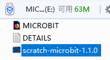
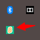
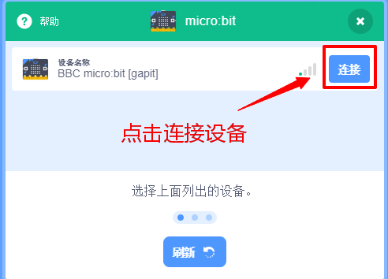
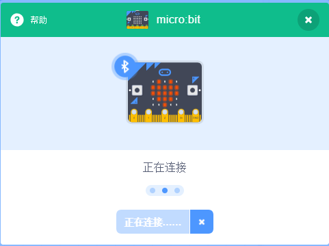
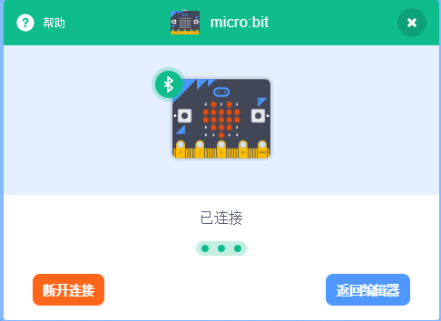
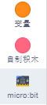
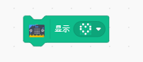
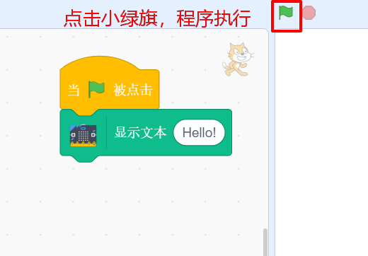

# Scratch3.0互动编程

1.将好搭Bit通过USB线与电脑连接，按下POWER键开机，电脑检测到名为MICROBIT的U盘。

2.下载下方文件，解压并将得到的文件拖放到好搭Bit中。



3.安装scratch link（未安装可[点击此处](https://scratch.mit.edu/microbit)下载）。启动Scratch Link并确认它正在运行。工具栏中会出现小图标。

4.打开Scratch3.0离线版软件，点击添加扩展。

5.选择microbit添加到项目。

6.连接设备。

连接设备成功后，返回编辑器，microbit扩展已添加至项目。

7.编写程序，对好搭bit实时控制。

 示例程序1： 

点击图形快，好搭Bit点阵屏显示爱心图案。 

示例程序2： 

点击右侧小绿旗，好搭Bit点阵屏滚动显示Hello！。

