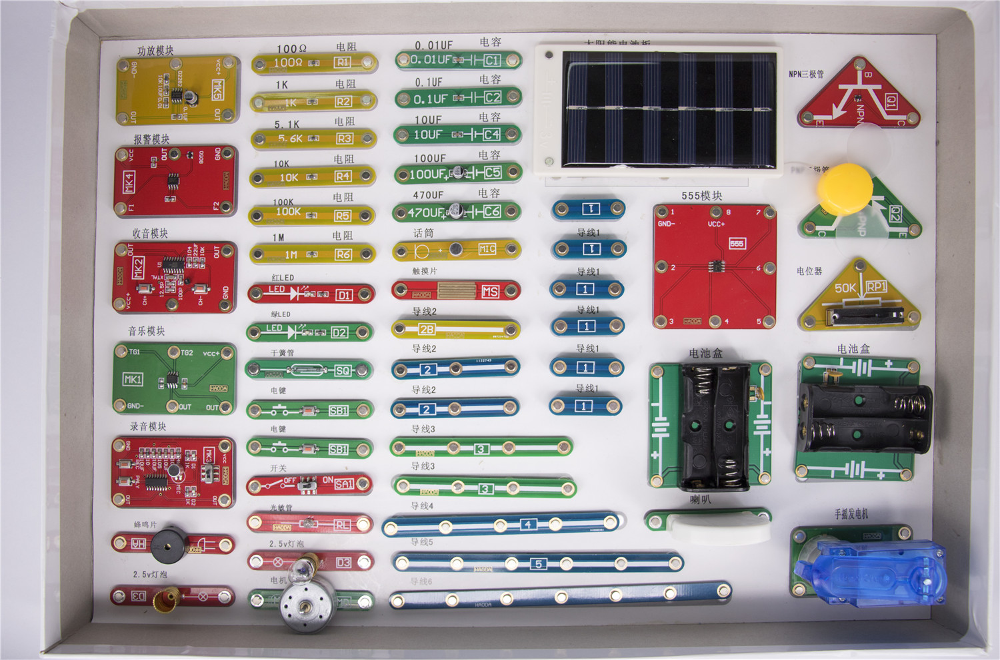

# 好搭磁性电子积木

## 概述

好搭磁性电子积木是一款针对电子电路学习研发的硬件套件。通过磁吸的方式连接，操作简便安全。

## 零件简介

## 相关资料

[电子电路入门](https://github.com/Haohaodada-official/docs/blob/master/jiao-xue-chan-pin/pdf/%E7%94%B5%E5%AD%90%E7%94%B5%E8%B7%AF%E5%85%A5%E9%97%A8-V2.pdf)

[“好搭”电子百拼典型电路及说明1](https://github.com/Haohaodada-official/docs/blob/master/jiao-xue-chan-pin/pdf/%E2%80%9C%E5%A5%BD%E6%90%AD%E2%80%9D%E7%94%B5%E5%AD%90%E7%99%BE%E6%8B%BC%E5%85%B8%E5%9E%8B%E7%94%B5%E8%B7%AF%E5%8F%8A%E8%AF%B4%E6%98%8E%E5%8D%B0%E5%88%B7%E7%89%88_100417.pdf)

[“好搭”电子百拼典型电路及说明2](https://github.com/Haohaodada-official/docs/blob/master/jiao-xue-chan-pin/pdf/%E2%80%9C%E5%A5%BD%E6%90%AD%E2%80%9D%E7%94%B5%E5%AD%90%E7%99%BE%E6%8B%BC%E5%85%B8%E5%9E%8B%E7%94%B5%E8%B7%AF%E5%8F%8A%E8%AF%B4%E6%98%8E%E5%8D%B0%E5%88%B7%E7%89%88_20050(1).pdf)

## 常见问题
