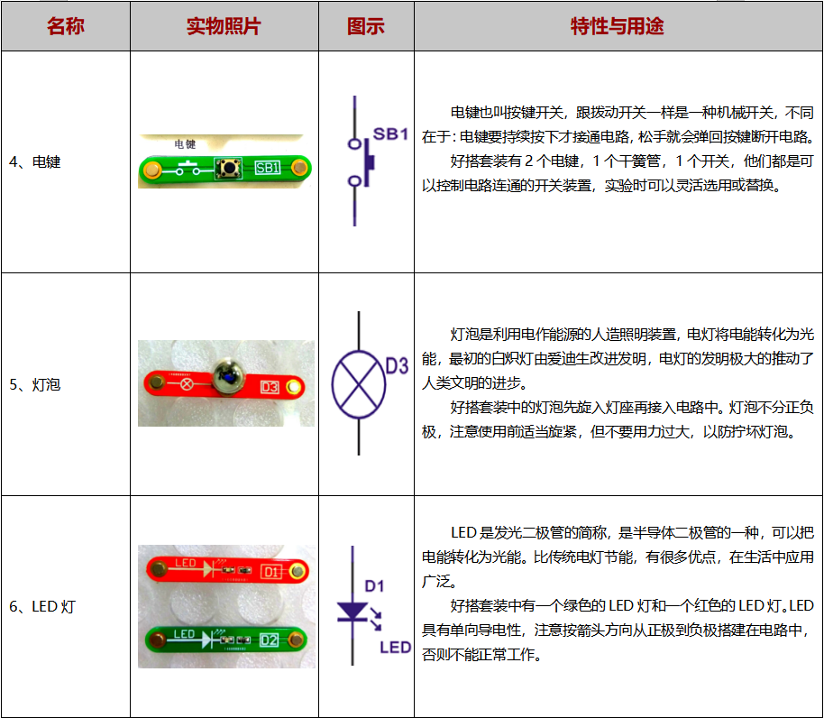
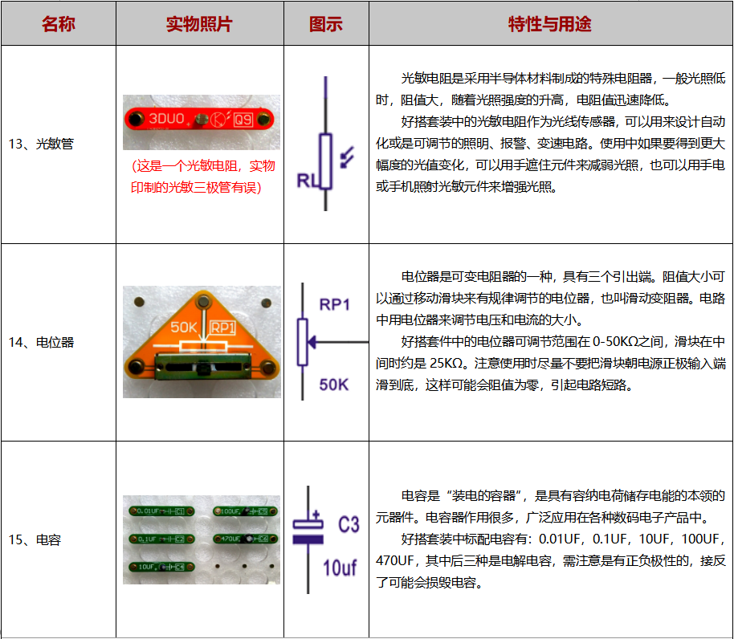

# 好搭磁性电子积木

## 概述

好搭磁性电子积木是一款针对电子电路学习研发的硬件套件。通过磁吸的方式连接，操作简便安全。

## 零件简介

## 相关资料

[电子电路入门](https://github.com/Haohaodada-official/docs/blob/master/jiao-xue-chan-pin/pdf/电子电路入门-V2.pdf)

[“好搭”电子百拼典型电路1](https://github.com/Haohaodada-official/docs/blob/master/jiao-xue-chan-pin/pdf/“好搭”电子百拼典型电路及说明印刷版_100417.pdf)

[“好搭”电子百拼典型电路2](https://github.com/Haohaodada-official/docs/blob/master/jiao-xue-chan-pin/pdf/“好搭”电子百拼典型电路及说明印刷版_20050.pdf)

## 常见问题

