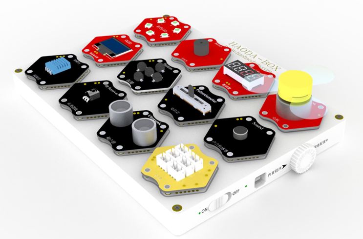
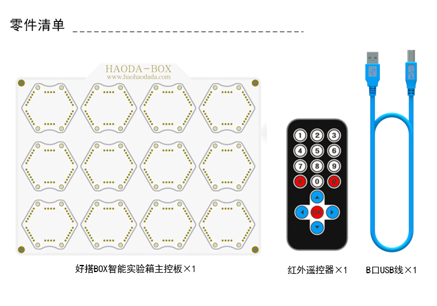
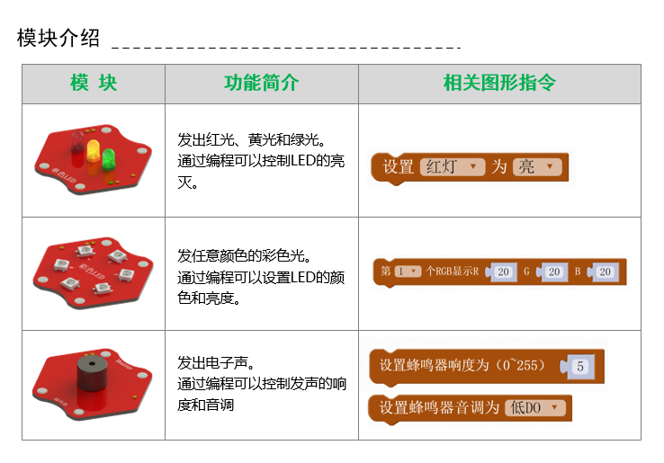
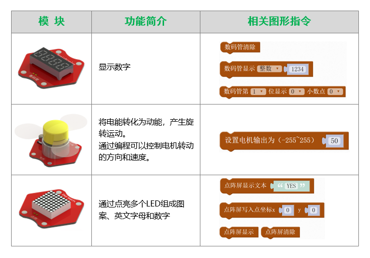
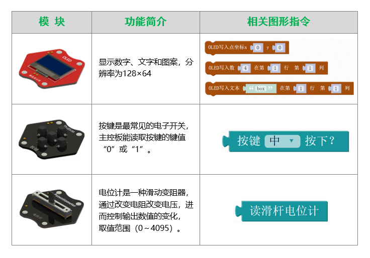
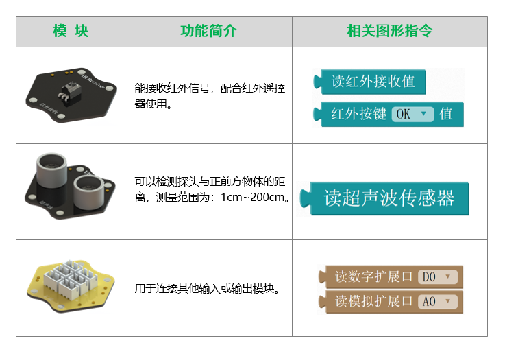
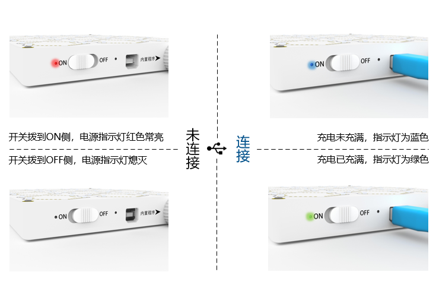
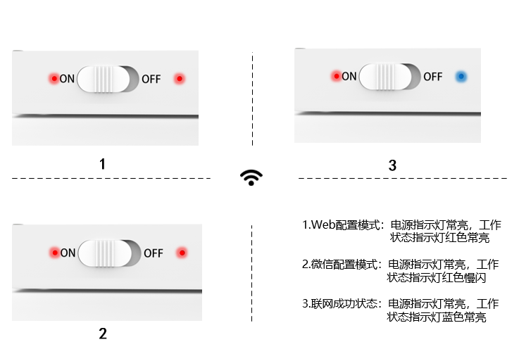
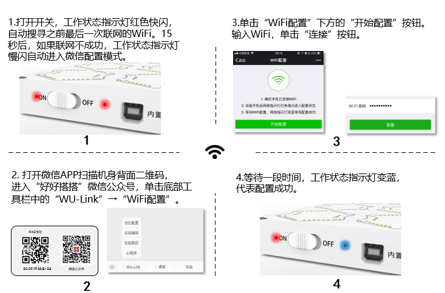

# 好搭BOX智能实验箱使用说明

## 概述

好搭BOX智能实验箱是一款定位于Scratch趣味编程课程与开源硬件课程之间的教育产品，是目前市场中最简单的硬件编程类产品。收纳方便的特点，非常合适大班教学。

## 参数
- 尺    寸：210 x 165 x 35mm
- 连接方式：磁性连接
- 电池容量：2000mA
- 充电电流：DC 5V 1A
- 下载方式：无线下载
- 内置程序：7种
- 模块数量：15种

## 清单

## 模块说明

## 侧边功能区

## 指示灯说明

## 网络配置

## 编程下载

## 课程

## 常见问题
