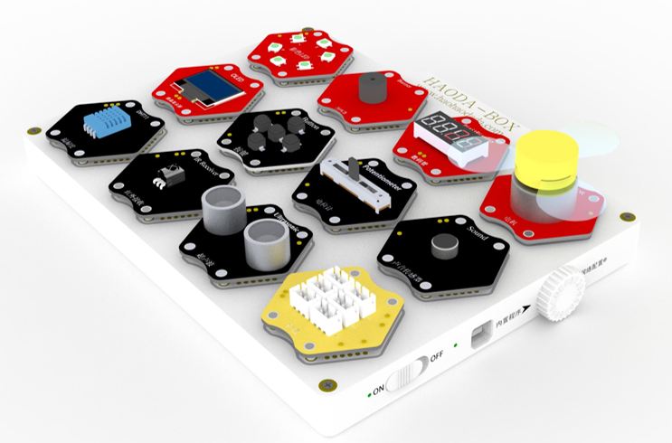
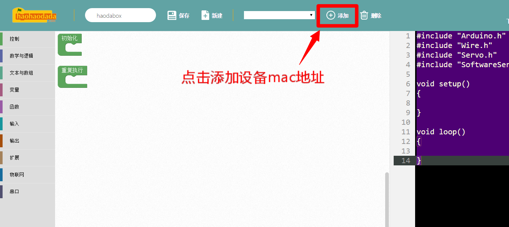
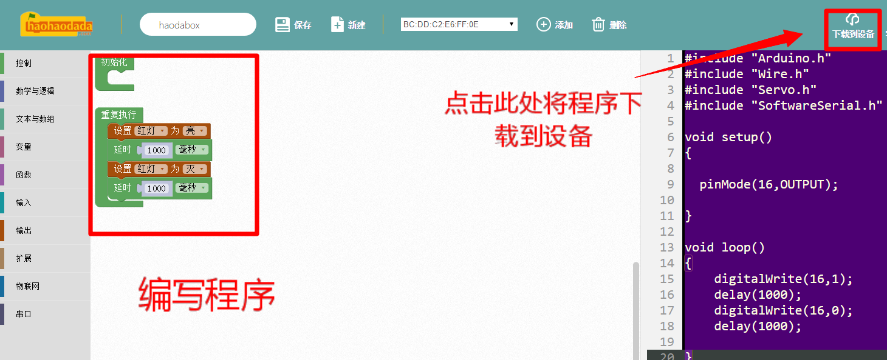

# 好搭Box

## 概述

好搭BOX智能实验箱是一款定位于Scratch趣味编程课程与开源硬件课程之间的教育产品，是目前市场中最简单的硬件编程类产品。收纳方便的特点，非常适合大班教学。

## 参数

* 尺        寸：210 x 165 x 35mm
* 连接方式：磁性连接
* 电池容量：2000mA
* 充电电流：DC 5V 1A
* 下载方式：无线下载
* 内置程序：7种
* 模块数量：15种

## 清单

## 模块说明

## 侧边功能区

## 指示灯说明

## 网络配置

## 编程下载

1.进入新版好好搭搭网站“创作”界面，下拉选择无线下载模式编程中的“好搭BOX智能实验箱”，点击进入好搭BOX编程界面。

2.进入好搭BOX编程界面，添加设备。

3.编写程序，点击下载到设备。程序下载成功后，好搭BOX的LED模块上红灯闪烁。

示例程序：

## 课程

## 常见问题

