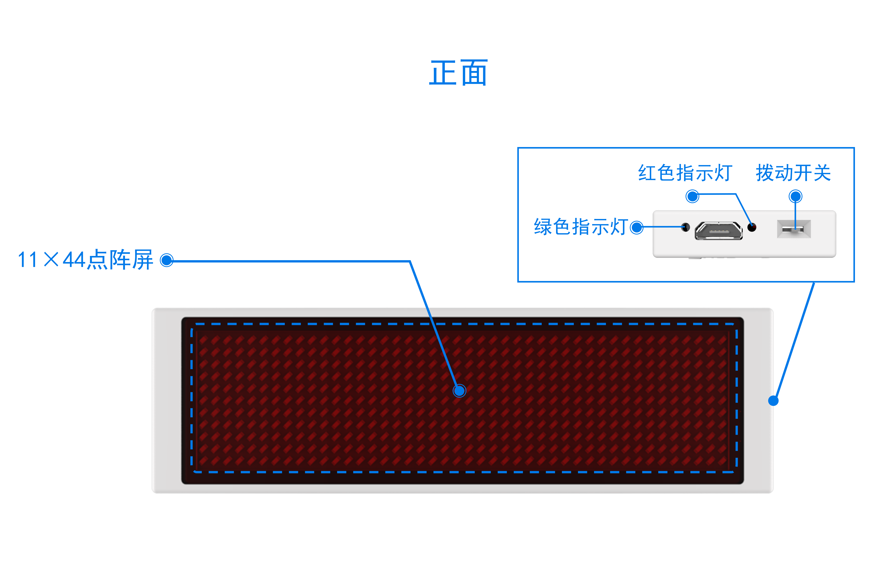

# 徽章板

## 概述

徽章板带有11×44点阵屏，能够显示中英文字符以及图案。集成了2.4G无线模块，可以实现无线通信功能。同时引出了2路PWM，2路AD和1路I2C与UART共用通道，方便用户自己扩展应用。

## 性能参数

* 输入电压：DC 5V
* 工作电流：空载灯全亮32mA
* 处 理 器：32位ARM芯片
* 数字端口：2个PWM通道,一个I2C和UART共用通道
* 模拟端口：2个12bit通道
* 下载方式：USB U盘模式下载
* 无线频率：204GHz
* 电池容量：250mAh
* 尺    寸：99×36mm

## 接口说明

## 扩展板接口说明

## 按键和指示灯说明

### USB未连接时

拨动开关拨到上方：开机。

拨动开关拨到下方：关机。

### USB已连接时

拨动开关拨到上方：进入正常工作模式，给锂电池充电。

拨动开关拨到下方：按下复位按键，进入U盘下载模式。

红色和绿色指示灯常亮：USB已连接，进入U盘下载模式。

红色指示灯常亮，绿色指示灯灭：锂电池正在充电。

绿色指示灯常亮，红色指示灯灭：锂电池已充满电。

## 使用方式

### 浏览器下载路径询问设置

徽章板采用U盘下载模式下载程序，点击下方查看浏览器下载路径设置方法。



### 程序下载

1.使用USB线，将徽章板与计算机连接起来。将徽章板拨动开关拨到下方，红色LED灯与绿色LED灯均亮起。

2.按下复位键，徽章板进入U盘下载模式，计算机检测到U盘接入。

3.[单击此处](http://www.haohaodada.com)进入“好好搭搭”网站，登录并点击进入创作界面。（如果没有账号，请先注册）。

4.下拉选择徽章板编程界面，点击进入。

5.进入徽章板编程界面，编程后点击下载到设备。弹出对话框，阅读后点击确定。

示例程序：

6.选择下载路径为haohaodada U盘并下载，下载成功后U盘自动弹出。

7.程序下载成功，点阵屏显示爱心。

## 编程界面

[点击此处](http://haohaodada.com/hz/)进入徽章板编程界面。

## 常见问题

Q：下载后，U盘自动弹出，如何再次下载程序？

A：按下徽章板复位按键，计算机再次检测到U盘，即可再次下载程序

