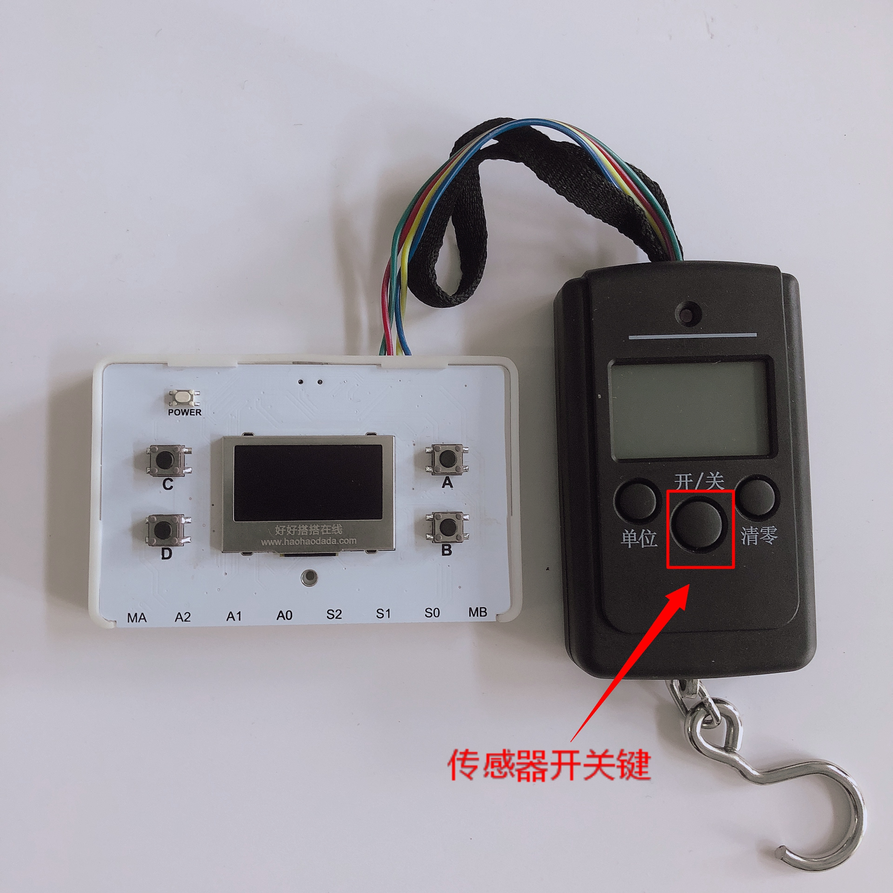

# 拉力传感器

## 概述

拉力传感器属于称重类传感器，将物理信号转变为可测量的电信号输出的装置，使用两个拉力传递部分传力。当有拉力时，弹性体（弹性元件，敏感梁）在外力作用下产生弹性变形，使粘贴在他表面的电阻应变片（转换元件）也随同产生变形，电阻应变片变形后，它的阻值将发生变化（增大或减小），再经相应的测量电路把这一电阻变化转换为电信号（电压或电流），从而完成了将外力变换为电信号的过程。其测量精度高、范围广、结构简单，方便用户测量及研究。

## 参数

* 工作电压：3.3V
* 最大容量：50kg
* 接口模式：PH2.0-4p
* 可用接口：I2C接口
* 尺寸：12x7.5x2.5mm

## 接口说明

* 可用端口：I2C接口

## 使用方式

1.将拉力传感器与数字科学家主控连接，按下传感器开关键，下载程序。

2.拉动拉力传感器钩子或悬挂重物，获取拉力值。

## 常见问题

