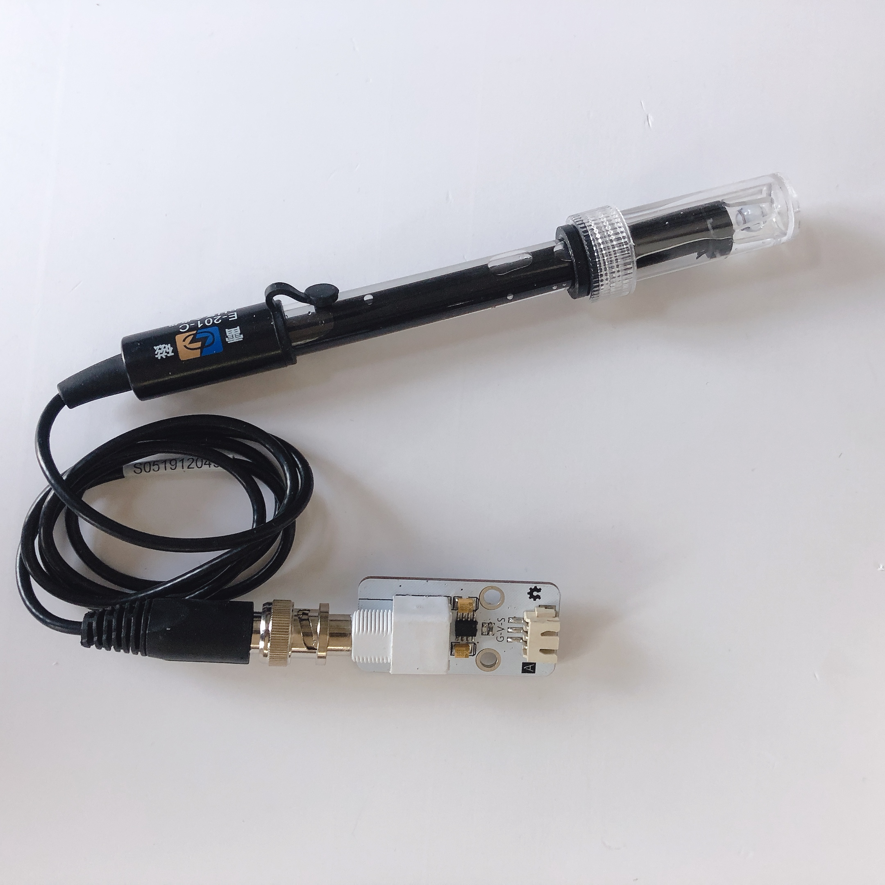
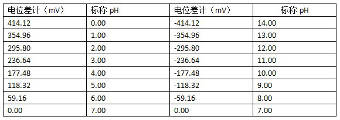
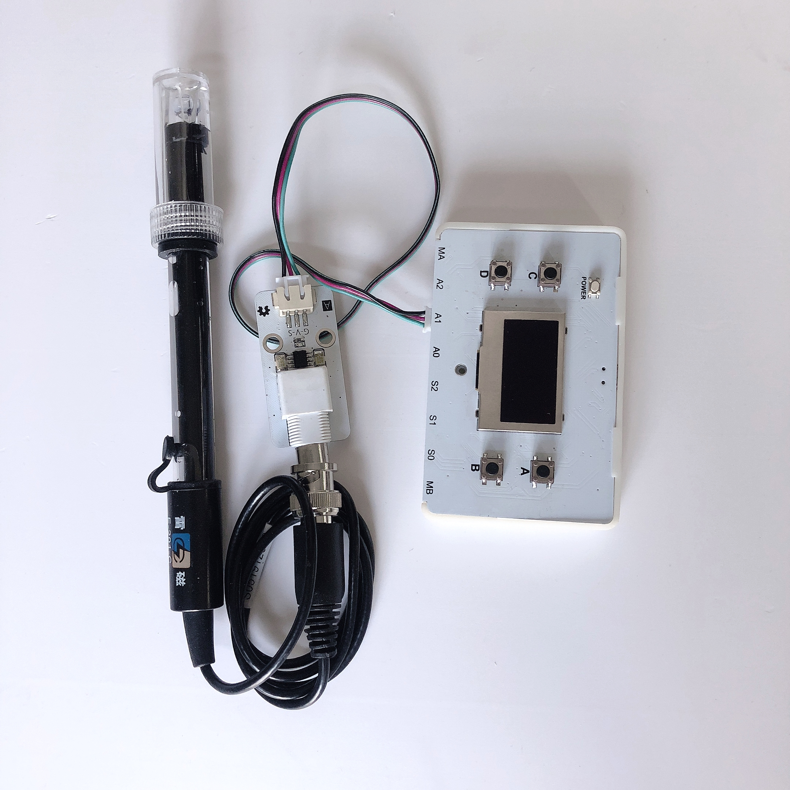
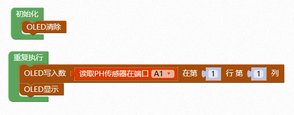

# PH值传感器

## 概述

PH计包括一个PH传感器和PH传感器模块，二者通过BNC接口相连。传感器的电极采用玻璃电极和参比电极组合在一起的塑壳不可填充式复合电极，是PH计测量元件，用来测量水溶液中的氢离子活度，即PH值。通过模块与数字科学家主控连接，可以非常方便的测量溶液的PH值。



## 参数

* 输入电压：3.3V
* 测量范围：0-14PH
* 精度：±0.1pH\(25℃\)
* 测量温度：0~60℃
* 接口模式：PH2.0-3p
* 尺寸：48x24mm

## 接口说明

* 可用端口：A0、A1、A2

## PH电极特性

探头电压输出情况（非模拟端电压输出）：



## 使用方式

将模块上的三线PH接口与数字科学家主控连接，BNC接口与PH传感器连接，将探头伸入被测溶液中，下载程序即可出测量溶液PH值。



注意：电极在每次连续使用前均需要使用标准缓冲溶液进行校正，为取得更正确的结果，环境温度最好在25℃左右，已知PH值要可靠，而且其PH值愈接近被测值愈好。如您测量的样品为酸性，请使用PH4.00的缓冲溶液对电极进行校正，如果您测量的样品为碱性，请使用PH9.18缓冲溶液对电极进行校正。分段进行校准，只是为了获得更好的精度。

```text
  pH电极每测一种pH不同的溶液，都需要使用清水清洗，建议使用去离子水清洗。 

  为保证测量精度，建议使用校准液对pH计定期校准，以防止出现较大误差。一般半年校准一次，如果测量的溶液中含有较多杂质，建议增加校准次数！ 
```

## 示例代码



## 尺寸说明


## 相关资源



## 常见问题

