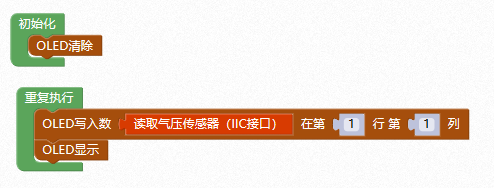

# 气压传感器

## 概述

气压传感器模块具有温度检测和大气压检测双重功能。气压传感器BMP280拥有较低的功耗，较高的分辨率以及采样频率。其基于博世成熟的压电式压力传感器技术，具有高EMC稳健性，高精度，低功耗等特点。

## 参数

* 工作电压：3.3V
* 气压测量范围：300hPa~1100hPa
* 气压测量精度：0.16Pa
* 温度测量范围：0~65℃
* 温度测量精度：0.01℃
* 工作温度：-40℃~+85℃
* 接口模式：PH2.0-4p
* 尺寸：48x24mm

## 接口说明

* 可用端口：I2C接口

## 使用方式

将气压传感器与主控板连接。


```text
注：由于传感器对环境条件非常敏感，请勿用手指触摸。
```

## 示例代码



## 尺寸说明


## 相关资源

[芯片BMP280芯片数据手册](https://github.com/Haohaodada-official/docs/blob/master/jiao-xue-chan-pin/pdf/xin-pian-shuo-ming/%E6%B0%94%E5%8E%8B%E4%BC%A0%E6%84%9F%E5%99%A8BMP280.PDF)

## 常见问题