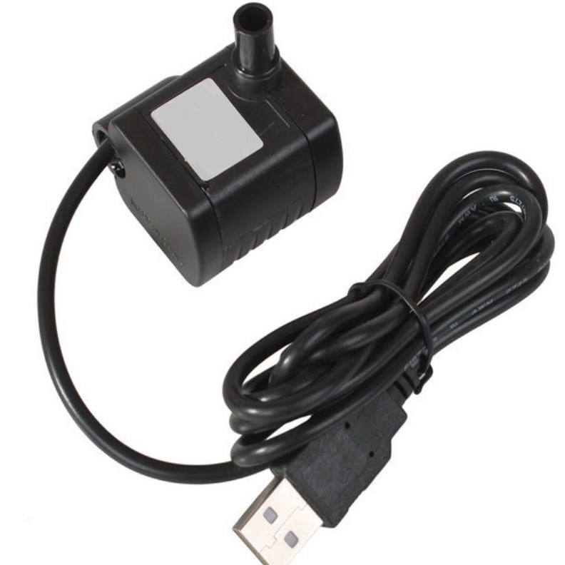
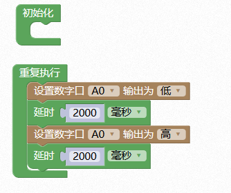

# 水泵

## 概述

水泵把原动机的机械能变为液体能量从而达到抽送液体的目的。在数字科学家套件中，包含微型水泵，它体积小，且水流量可调，适用于很多环境，也可制作工艺品，用户可充分发挥想象力，做出创意且有意义的小发明。



## 参数

* 电压：3.3~9V
* 电源接口：USB接口
* 功率：1~8W
* 流量：200~750L/H
* 扬程：0.4-1.5m
* 出水咀：∅8mm
* 尺寸：39x32x28mm

## 接口说明

* 可用端口：A0、A1、A2、S0、S1、S2

## 使用方式

对水泵的控制主要借助继电器模块实现。

1.将水泵USB线拨开，将任意一根线剪断，注意保持其余两根线完好，将剪断的线两头拨开并与继电器连接（COM-NO或者COM-NC）。


2.将水泵平置放入水中，水高度以没过水泵为宜，以免缺水烧机。

3.将水泵USB线与移动电源连接，继电器与数字科学家主控连接。


4.打开移动电源供电，下载程序即可控制水泵工作

```text
注：若使用过程中出现故障，请尽快切断电源，离水才可检修。
```

## 示例代码



## 常见问题

