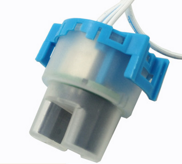
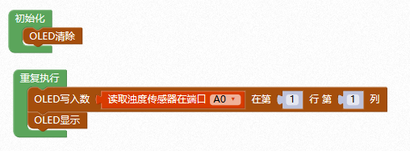

# 水浊度传感器

## 概述

水浊度传感器利用光学原理，通过测量溶液中的透光率和散射率来综合判断溶液浊度情况，从而达到检测水质的目的。传感器内部是一个红外线对管，当光线穿过一定量的水时，光线的透过量取决于该水的污浊程度，水越污浊，透过的光就越少。



## 参数

* 工作电压：5V
* 工作温度：-20~90℃
* 浊度范围：0~1000±30NTU
* 接口模式：PH2.0-3p

## 接口说明

* 可用端口：A0、A1、A2

## 浑浊度说明

浑浊度的单位是用"度"来表示的，就是相当于1L的水中含有1mg.的SiO2（或是1mg白陶土、硅藻土）时，所产生的浑浊程度为1度。浊度单位为JTU，1NTU=1mg/L的白陶土悬浮体。现代仪器显示的浊度是散射浊度单位NTU，也称TU。1TU=1JTU。

## 使用方式

1.传感器检测：将传感器放置于NTU&lt;0.5的清水中进行测试，电压输出为 V=4.1±0.3V。

2.将水浊度传感器与数字科学家主控连接，下载程序即可检测水质。


```text
注：浊度传感器顶端不防水，使用时水面不能没过顶盖与壳体连接处。
```

## 示例代码



## 常见问题

