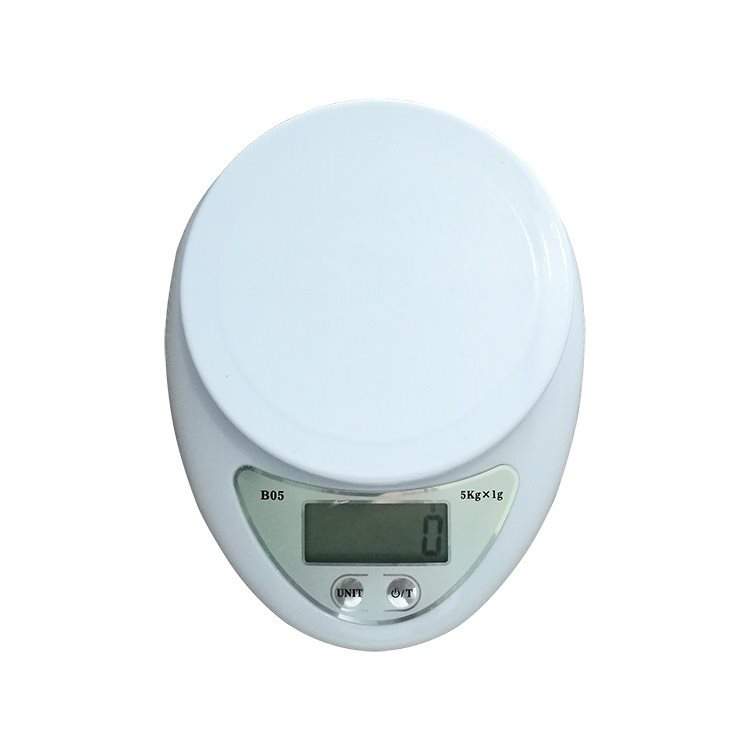
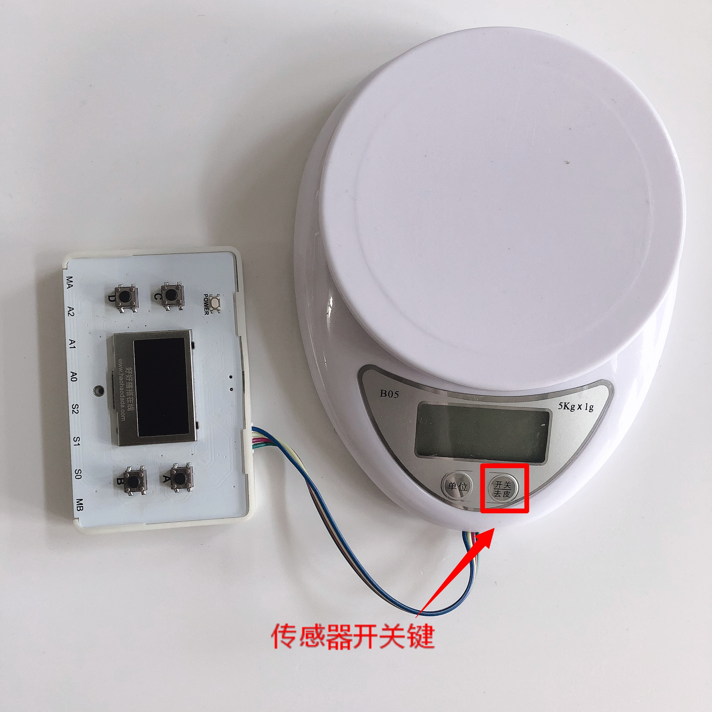

# 压力传感器

## 概述

压力传感器将质量信号转变为可测量的电信号输出。此套件中压力传感器配备高精度应变片传感器，在载物台放上物品即可快速获取其压力值。其性能稳定，响应速度快，且操作简单，方便用户迅速上手，进行有趣的实验和创意。

## 参数

* 工作电压：3.3-5V
* 测量范围：0~5kg
* 分度值：1g
* 操作温度:10 - 40℃
* 工作湿度:≤85% rh
* 接口模式：PH2.0-4p
* 尺寸：约16x11.3x3.2cm

## 接口说明

* 可用端口：I2C接口

## 使用方式

1.将压力传感器与数字科学家主控连接，按下传感器电源键开机，下载程序。

2.将重物置于载物台，获取压力值。

## 常见问题

