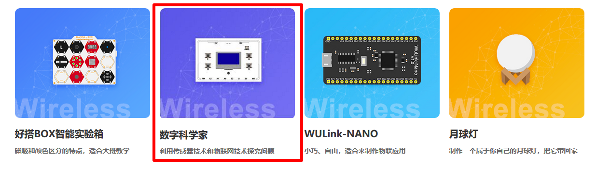
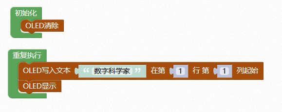

# 主控

## 概述

数字科学家通过主机与各种传感器完成有趣的科学探究，板载OLED显示屏、5个按键、9轴传感器、蜂鸣器并添加外接接口，可与通用传感器模块连接实现更多功能，同时兼容乐高结构，方便用户在科学探究的同时轻松造物，实现创意。

## 性能参数

* 电池容量：630mA
* 充电电压：5V
* 工作电压：3.3V
* 下载方式：无线下载
* 扩展接口：2路电机接口，3路PWM接口，3路AD接口，2路通讯接口
* 尺寸：54.3x84.8mm

## 接口说明

## 模式说明

* 运行模式：按下电源键开机，红色状态指示灯常亮。
* 充电模式: 连接USB数据线至计算机USB口或充电器，充电指示灯在充电时亮红灯，充满电亮蓝灯。

## 联网配置

1.按住C键的同时按下POWER键开机，蜂鸣器响一声，再按一下C键，蜂鸣器长响一声，数字科学家主控进入配网模式，打开手机wifi连接界面，加入设备的网络。

2.打开好好搭搭微信公众号，进入好搭物联网小程序的WIFI配置栏，为数字科学家主控配网。

具体配网操作：



## 程序下载

1.[单击此处](http://www.haohaodada.com)进入好好搭搭网站，登录并点击进入创作界面。

2.下拉选择数字科学家编程界面，点击进入。

3.进入数字科学家编程界面，输入设备的mac地址，填写程序，点击下载到设备。

示例程序：

4.下载成功后，数字科学家主控板载蜂鸣器响，板载OLED屏显示“数字科学家”五个字。

## 常见问题

1.配置网络的原理是什么

通过手机把我们的路由器的网络账号告诉WU-Link，让她能顺利的连上网络

2.一个路由器最多能带几台设备

一般路由建议不要超过10台设备。

3.怎么解绑MAC地址 在原来绑定的账号里删除即可，如果忘记原来帐号，请联系技术支持。

