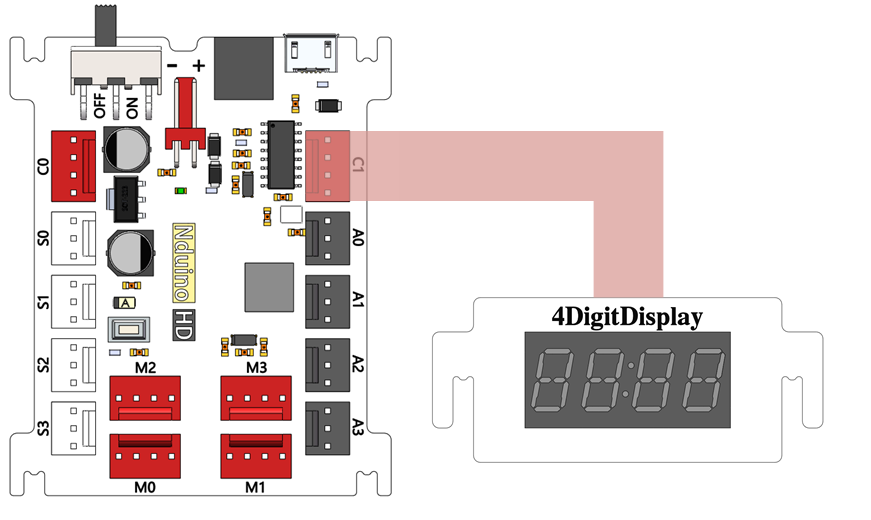
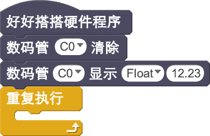
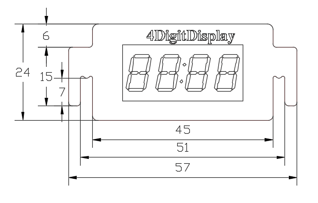

# 4位计时数码管模块说明

## 概述
NOVA的数码管计时模块可以用来显示时间。配套的驱动程序，做了简化设计，方便用户快速上手。

## 参数
- 尺寸：57x24mm
- 工作电压：+5V
- 类型：4位8段共阴数码管
- 接口模式：2510-4p
- 引脚定义：1、2-控制端 3-电源 4-地

## 接口说明
- 可用端口： C0、C1、M0、M1、M2、M3

## 使用方式

## 示例代码

[4位计时数码管模块示例代码](http://www.haohaodada.com/show.php?id=947104)

## 原理图
[4位计时数码管模块原理图](https://github.com/Haohaodada-official/haohaodada-docs/blob/master/%E5%8E%9F%E7%90%86%E5%9B%BE/4%E4%BD%8D%E6%95%B0%E7%A0%81%E7%AE%A1%E6%A8%A1%E5%9D%97.pdf)

## 尺寸说明

## 相关资源

[TM1650芯片手册](https://github.com/Haohaodada-official/haohaodada-docs/blob/master/%E4%B8%BB%E8%A6%81%E8%8A%AF%E7%89%87%E8%AF%B4%E6%98%8E%E4%B9%A6/%E6%95%B0%E7%A0%81%E7%AE%A1-TM1650.PDF)

## 常见问题
