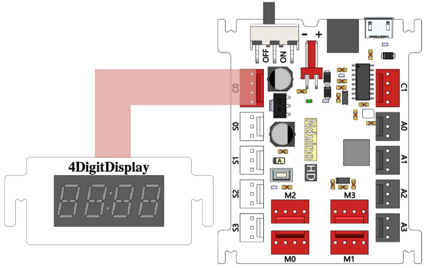

# 4位计时数码管

## 概述

NOVA的数码管计时模块可以用来显示时间。配套的驱动程序，做了简化设计，方便用户快速上手。

## 参数

* 尺寸：57x24mm
* 工作电压：+5V
* 类型：4位8段共阴数码管
* 接口模式：2510-4p
* 引脚定义：1、2-控制端 3-电源 4-地

## 接口说明

* 可用端口： C0、C1、M0、M1、M2、M3

## 使用方式

## 示例代码

[4位计时数码管模块示例代码](http://www.haohaodada.com/show.php?id=947104)

## 原理图



## 尺寸说明

## 相关资源



## 常见问题

