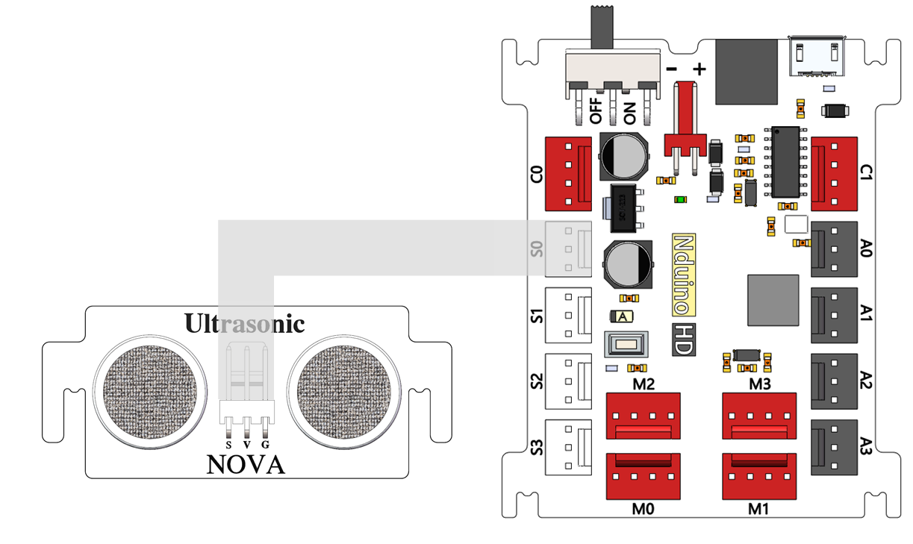
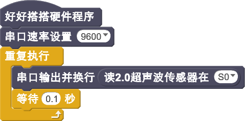
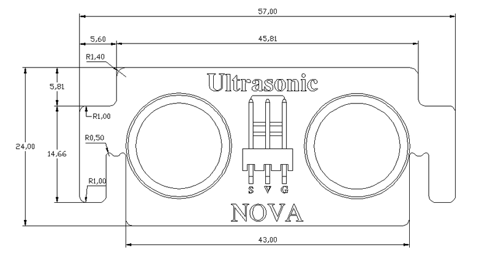

# 超声波传感器模块

## 概述

NOVA超声波模块有效探测距离范围为4-400cm，一个发射探头，一个接受探头。此模块只需你提供一个10uS以上脉冲触发信号，该模块内部将发出8个40kHz周期电平并检测回波。一旦检测到有回波信号则输出回响信号。回响信号的脉冲宽度与所测的距离成正比。由此通过发射信号到回响信号的时间间隔可以计算得到距离。建议测量周期为60ms以上，以防发射信号对回响信号的影响。

## 参数

* 尺寸：24x57mm
* 电源要求：+3.3-5V
* 类型：数字模式
* 接口模式：2510-3p
* 引脚定义：1-控制端 2-电源 3-地

## 接口说明

* 可用端口： A0、A1、A2、A3、S0、S1、S2、S3

## 使用方式

## 示例代码

[超声波传感器模块示例代码](http://www.haohaodada.com/show.php?id=947506)

## 原理图



## 尺寸说明

## 相关资源







## 常见问题

