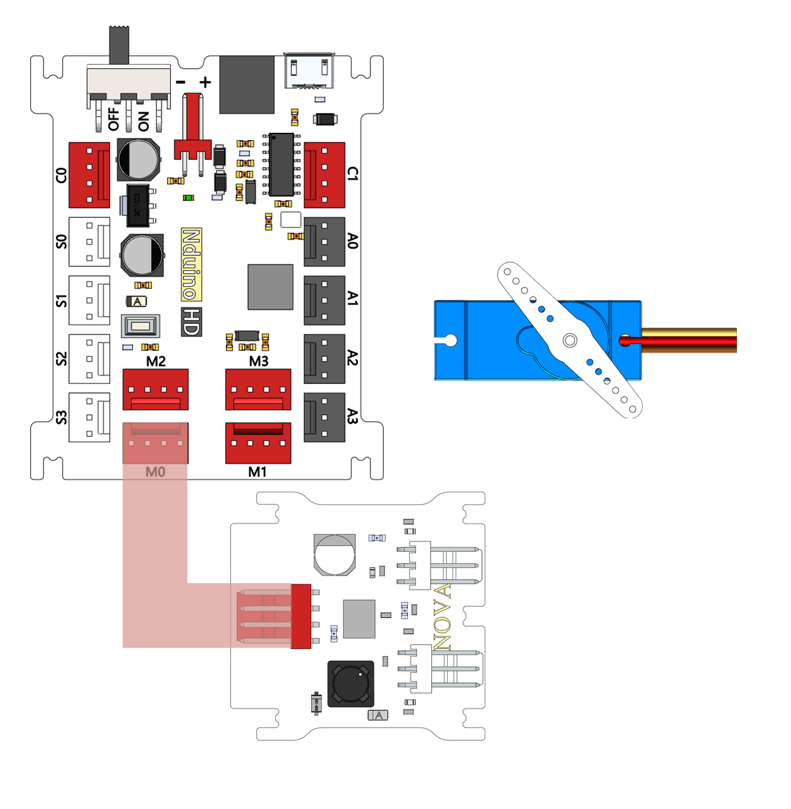
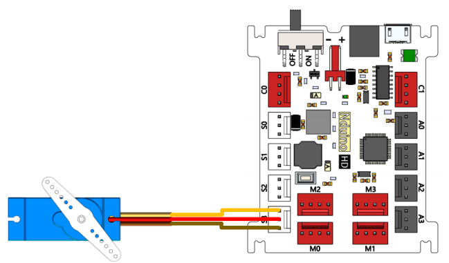
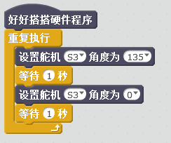
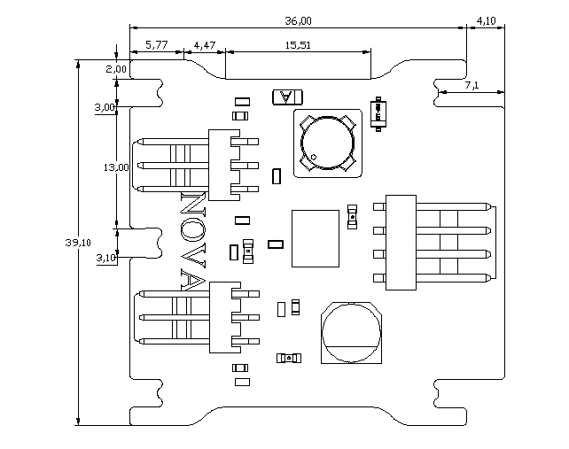

# 大电流舵机驱动模块

## 概述

NOVA的舵机模块是专为驱动舵机而设计的，采用大电流MP1584芯片，它是高频率，快速响应，最高可输出3A电流，宽电压：4.5V-28V。静态电流100uA，开关频率100KHz-1.5MHz。当负载较轻时可以调到高脉冲跳跃模式，内部软启动。模块设置MP1584输出6V。 舵机有三根引出线，棕、红、橙分别对应负极、正极、信号线（有些是黑红白线，分别对应负极、正极、信号线） 控制信号由接收机的通道进入信号调制芯片，获得直流偏置电压。它内部有一个基准电路，产生周期为20ms，宽度为1.5ms的基准信号，将获得的直流偏置电压与电位器的电压比较，获得电压差输出。最后，电压差的正负输出到电机驱动芯片决定电机的正反转。当电机转速一定时，通过级联减速齿轮带动电位器旋转，使得电压差为0，电机停止转动。 舵机的控制一般需要一个20ms左右的时基脉冲，该脉冲的高电平部分一般为0.5ms-2.5ms范围内的角度控制脉冲部分，总间隔为2ms。以180度角度伺服为例，那么对应的控制关系是这样的： 0.5ms--------------0度； 1.0ms------------45度； 1.5ms------------90度； 2.0ms-----------135度； 2.5ms-----------180度；

## 参数

* 尺寸：40.1x39.1mm
* 电源要求：+5V
* 接口模式：2510-4p
* 引脚定义：1、2-控制端 3-电源 4-地

## 接口说明

* 可用端口： C0、C1、M0、M1、M2、M3

## 使用方式

舵机连接方式：

## 示例代码

[大电流舵机驱动模块示例代码](http://www.haohaodada.com/show.php?id=947545)

## 原理图

[大电流舵机驱动模块原理图](https://github.com/Haohaodada-official/haohaodada-docs/blob/master/原理图/大电流舵机驱动模块.pdf)

## 尺寸说明

## 相关资源

[MP1584芯片手册](https://github.com/Haohaodada-official/haohaodada-docs/blob/master/主要芯片说明书/舵机驱动-MP1584.PDF)

## 常见问题

