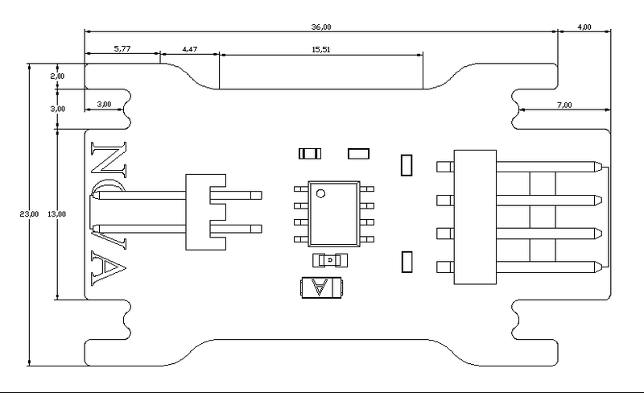

# 单路电机驱动模块

## 概述

NOVA的单路电机模块，可以实现单路电机的方向控制，支持PWM调速控制，在小车、风扇上有大应用。

## 参数

* 尺寸：40.1x39mm
* 驱动芯片L9110S是为控制和驱动电机设计的两通道推挽式功率放大专用集成电路器件。
* 板载芯片L9110S的最大驱动电流为750mA-850mA，典型值800mA，峰值电流可达1.5-2.0A。
* 电源电压：2.2-12V，典型值6V；静态电流最大2.0uA，典型值0.1uA。
* 两个输入引脚兼容TTL/CMOS电平，可直接连CPU
* 两路输出通道，每通道具有800mA连续输出能力，并且输出内置钳位二极管，能释放感性负载的反向冲击电流，安全可靠，可直接驱动直流电机，输出具有正转、反转、高阻和刹车
* 接口模式：2510-4p
* 引脚定义：1、2-控制端 3-电源 4-地

## 接口说明

* 可用端口： M0、M1、M2、M3

## 使用方式

## 示例代码

[单路电机驱动模块示例代码](http://www.haohaodada.com/show.php?id=947557)

## 原理图

[单路电机驱动模块原理图](https://github.com/Haohaodada-official/docs/blob/master/jiao-xue-chan-pin/pdf/yuan-li-tu/%E5%8D%95%E8%B7%AF%E7%94%B5%E6%9C%BA%E9%A9%B1%E5%8A%A8%E6%A8%A1%E5%9D%97.pdf)

## 尺寸说明

## 常见问题

