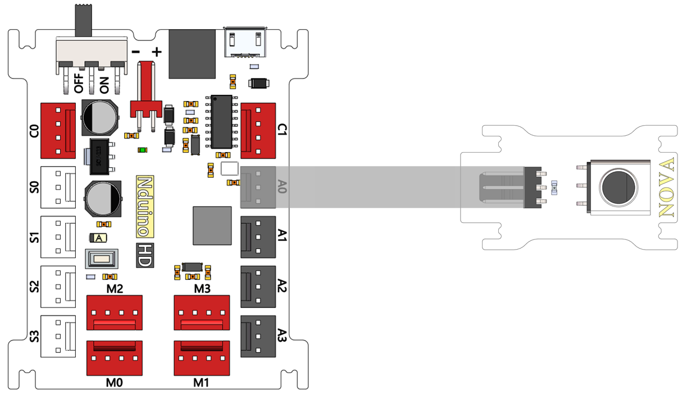
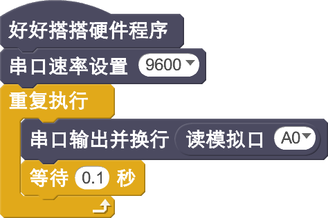
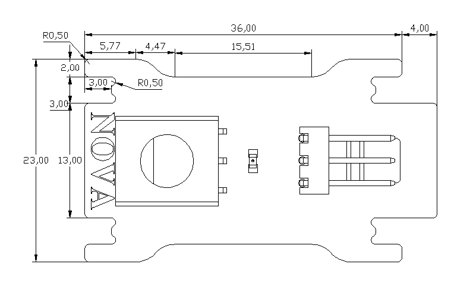

# 电位器模块说明

## 概述
电位器式传感器是一种常用的电子元件，广泛应用于各种电器和电子设备中。它是一种把机械的线位移和角位移输入量转换为与它成一定函数关系的电阻和电压输出的传感元件。

## 参数
- 输入电压：5V
- 尺寸：40x23mm
- 输出类型：模拟信号
- 接口模式：PH2.0-3p
- 转动角度：300°
- 重量：10g
- 接口模式：2510-3p
- 引脚定义：1-控制端 2-电源 3-地

## 接口说明
- 可用端口： A0、A1、A2、A3

## 使用方式

## 示例代码

[电位器模块示例代码](http://www.haohaodada.com/show.php?id=947651)

## 原理图
[电位器模块原理图](https://github.com/Haohaodada-official/haohaodada-docs/blob/master/%E5%8E%9F%E7%90%86%E5%9B%BE/%E7%94%B5%E4%BD%8D%E5%99%A8%E6%A8%A1%E5%9D%97.pdf)

## 尺寸说明

## 相关资源

[电位器数据手册](https://github.com/Haohaodada-official/haohaodada-docs/blob/master/%E4%B8%BB%E8%A6%81%E8%8A%AF%E7%89%87%E8%AF%B4%E6%98%8E%E4%B9%A6/%E7%94%B5%E4%BD%8D%E5%99%A8-%E7%94%B5%E4%BD%8D%E5%99%A8.PDF)

## 常见问题
