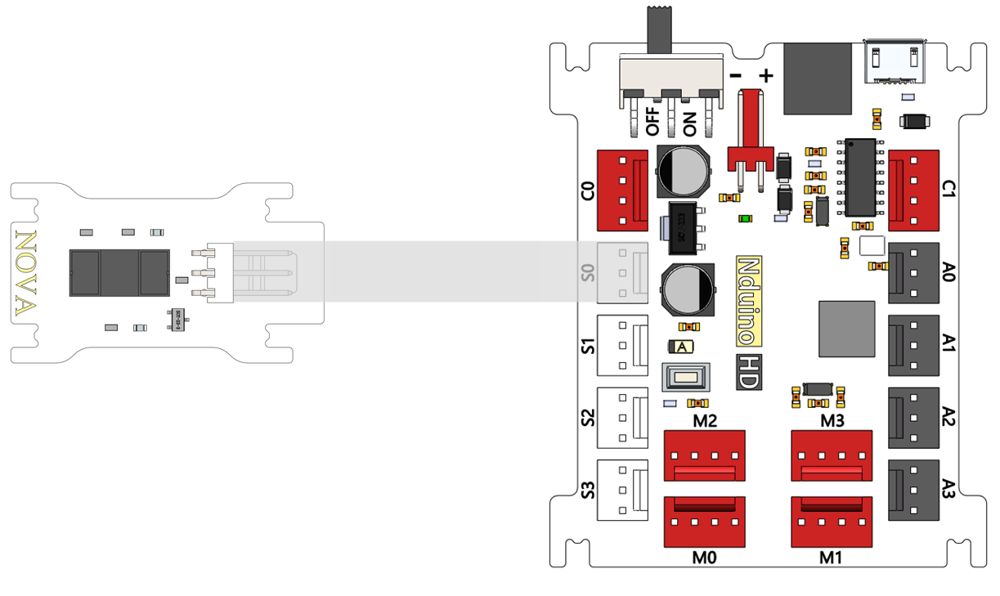
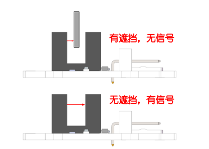
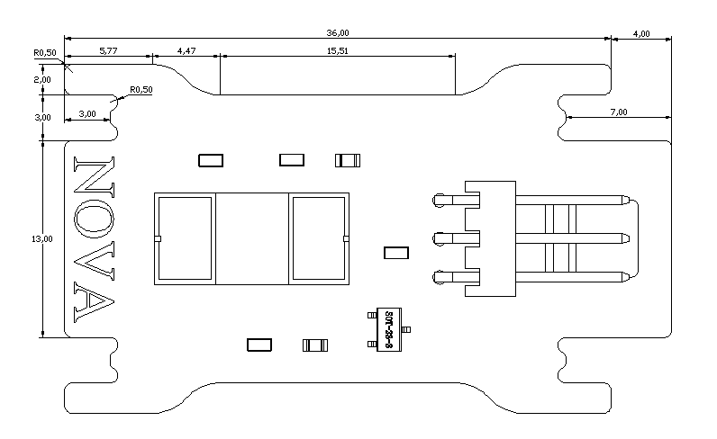

# 红外对射模块

## 概述

红外对射传感器ITR9608,是一种槽型光电开关，内部结构由红外发射二极管和NPN型光敏三极管构成，能自己发送红外线并自己接收。正常通电情况下红外发射二极管发射出红外线，接收头光敏三极管接收到红外线，光敏三极管导通，板子输出低电平，绿色LED状态指示灯灭。当有遮挡物挡住槽子中间的红外线时，接收头光敏三极管不能导通，板子输出高电平，绿色LED状态指示灯亮。可以利用输出高低电平和状态灯的亮灭。 可以用在检测物体经过。

## 参数

* 输入电压：5V
* 尺寸：40x23mm
* 电气参数： 输入端（红外发射二极管）电压5V，最大输入反向电压5V，最大输入端峰值电流1A。输出端（NPN光敏三极管）Vceo最大30V，Veco最大5V，Ic最大20mA。
* 输入端（红外发射二极管）正向压降最大1.5V，典型值1.2V。
* 截止波长940nm。
* 接口模式：2510-3p
* 引脚定义：1-控制端 2-电源 3-地

## 接口说明

* 可用端口： A0、A1、A2、A3、S0、S1、S2、S3

## 使用方式

光电开关内部结构：

## 示例代码

[红外对射模块示例代码](http://www.haohaodada.com/show.php?id=947645)

## 原理图

[红外对射模块原理图](https://github.com/Haohaodada-official/docs/blob/master/jiao-xue-chan-pin/pdf/yuan-li-tu/%E7%BA%A2%E5%A4%96%E5%AF%B9%E5%B0%84%E6%A8%A1%E5%9D%97.pdf)

## 尺寸说明

## 相关资源

[光电开关ITR9608数据手册](https://github.com/Haohaodada-official/docs/blob/master/jiao-xue-chan-pin/pdf/xin-pian-shuo-ming/%E7%BA%A2%E5%A4%96%E5%AF%B9%E5%B0%84-%E5%85%89%E7%94%B5%E5%BC%80%E5%85%B3ITR9608.PDF)

## 常见问题

