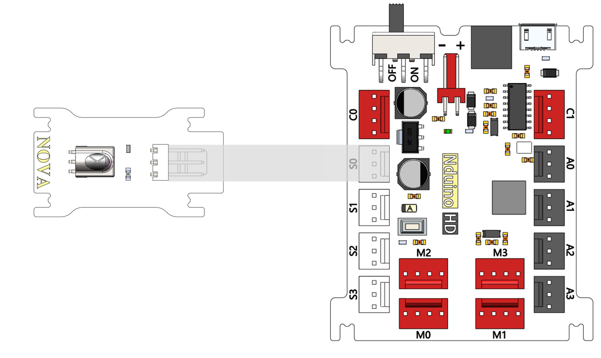
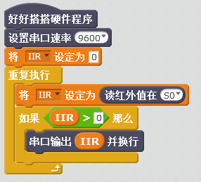
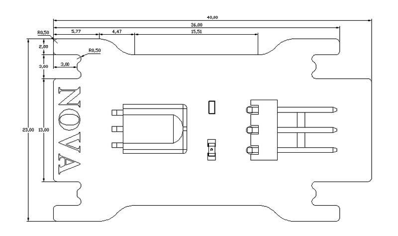

# 红外接收模块

## 概述

NOVA的红外接收模块需要配套的NOVA红外遥控器一起使用。

## 参数

* 尺寸：40x23mm
* 电源要求：+5V
* 接口模式：2510-3p
* 引脚定义：1-控制端 2-电源 3-地

## 接口说明

* 可用端口： A0、A1、A2、A3、S0、S1、S2、S3

## 使用方式

## 示例代码

[红外接收模块示例代码](http://www.haohaodada.com/show.php?id=1068035)

## 原理图

[红外接收模块原理图](https://github.com/Haohaodada-official/docs/blob/master/jiao-xue-chan-pin/pdf/yuan-li-tu/红外接收模块.pdf)

## 尺寸说明

## 常见问题

