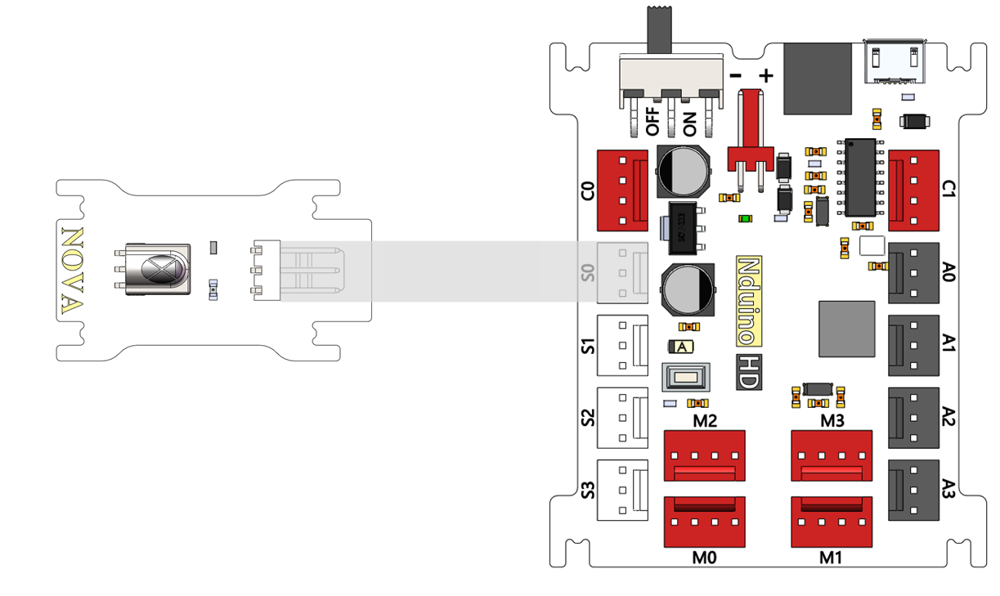
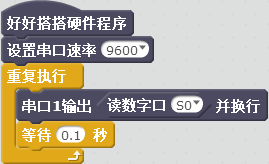
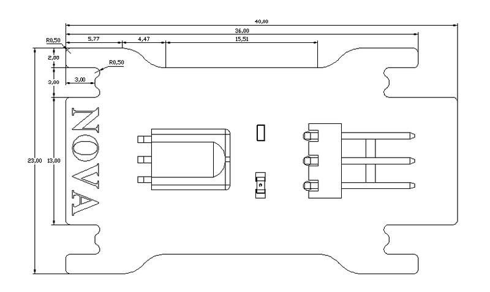

# 红外接收模块说明

## 概述
NOVA的红外接收模块需要配套的NOVA红外遥控器一起使用。

## 参数
- 尺寸：40x23mm
- 电源要求：+5V
- 接口模式：2510-3p
- 引脚定义：1-控制端 2-电源 3-地

## 接口说明
- 可用端口： A0、A1、A2、A3、S0、S1、S2、S3

## 使用方式

## 示例代码

[红外接收模块示例代码](http://www.haohaodada.com/show.php?id=947645)

## 原理图
[红外接收模块原理图](https://github.com/Haohaodada-official/haohaodada-docs/blob/master/%E5%8E%9F%E7%90%86%E5%9B%BE/%E7%BA%A2%E5%A4%96%E6%8E%A5%E6%94%B6%E6%A8%A1%E5%9D%97.pdf)

## 尺寸说明

## 常见问题
