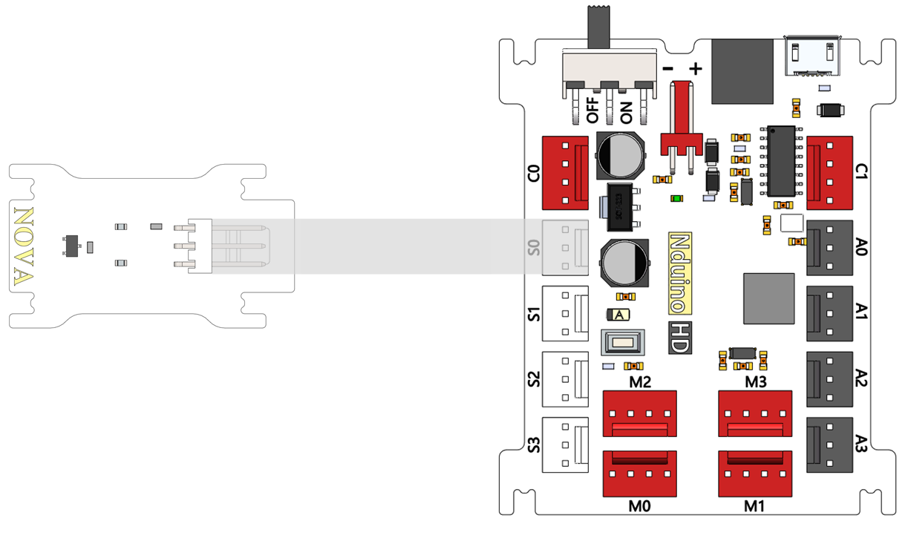
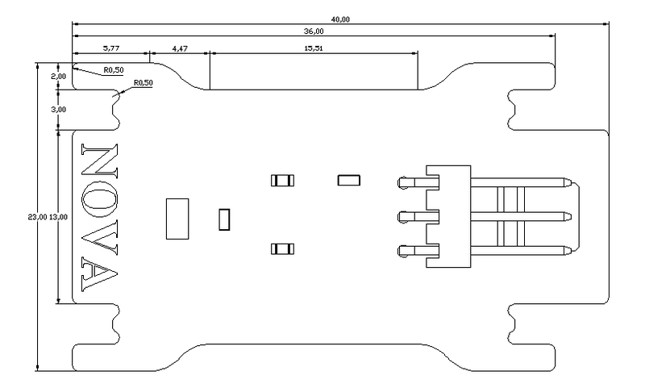

# 霍尔开关模块

## 概述

NOVA霍尔传感器是基于霍尔感应原理的超敏感磁性传感器，低功耗，数字锁存输出，可以用来对磁性材料（磁铁）的探测，且不分极性，探测范围和磁性强弱有关，具有对磁场敏感、结构简单、体积小、频率响应宽、输出电压变化大和使用寿命长等优点。与Arduino专用传感器扩展板结合使用，可以制作与磁性材料（磁铁）相关的互动作品。

## 参数

* 输入电压：5V
* 尺寸：40x23mm
* 接口类型：数字
* 输出信号：平时输出低电平，检测到磁性时输出高电平（同时板载LED亮）
* 重量：5g
* 接口模式：2510-3p
* 引脚定义：1-控制端 2-电源 3-地

## 接口说明

* 可用端口： A0、A1、A2、A3、S0、S1、S2、S3

## 使用方式

## 示例代码

[霍尔开关模块示例代码](http://www.haohaodada.com/show.php?id=947645)

## 原理图

[霍尔开关模块原理图](https://github.com/Haohaodada-official/haohaodada-docs/blob/master/原理图/霍尔开关模块.pdf)

## 尺寸说明

## 常见问题

