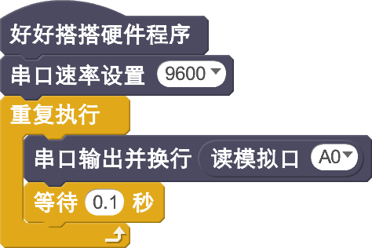

# 火焰传感器模块

## 概述

火焰传感器是机器人专门用来搜寻火源的传感器，当然火焰传感器也可以用来检测光线的亮度，只是本传感器对火焰特别灵敏。火焰传感器利用红外线对对火焰非常敏感的特点，使用特制的红外线接受管来检测火焰，然后把火焰的亮度转化为高低变化的电平信号。

## 参数

* 尺寸：40x23mm
* 类型：模拟信号
* 电源要求: 3.3V到5V DC
* 探测距离:20cm（4.8V）~ 100cm（1V）
* 能够探测的光谱带：760nm到1100nm
* 反馈时间：15us
* 接口模式：模拟
* 接口模式：2510-3p
* 引脚定义：1-控制端 2-电源 3-地

## 接口说明

* 可用端口： A0、A1、A2、A3

## 使用方式

## 示例代码

[火焰传感器模块示例代码](http://www.haohaodada.com/show.php?id=947651)

## 原理图

[火焰传感器模块原理图](https://github.com/Haohaodada-official/docs/blob/master/jiao-xue-chan-pin/pdf/yuan-li-tu/%E7%81%AB%E7%84%B0%E4%BC%A0%E6%84%9F%E5%99%A8%E6%A8%A1%E5%9D%97.pdf)

## 尺寸说明

## 常见问题

