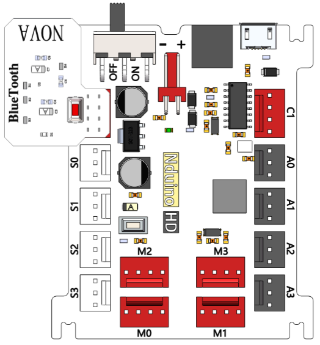

# 蓝牙4.0模块

## 概述

## 参数

* 蓝牙芯片： TI CC2540
* 工作频率： 2.4GHz
* 数据速率-最大值： 1Mbps GFSK
* 调制或协议： 蓝牙低功耗，V4.0
* 功耗： 工作时：平均10.6mA；待机：8.7mA
* 灵敏度： -93dBm
* 尺寸：29x24mm
* 电压-电源： 3.3V
* 工作温度范围： -10 ℃ ~ +65 ℃
* 最远传输距离： 30m左右（空旷地带）

## 接口说明

* 可用端口： C0、C1、M0、M1、M2、M3

## 使用方式

## 示例代码

[蓝牙4.0模块示例代码](http://www.haohaodada.com/show.php?id=955396)

## 原理图

[蓝牙模块原理图](https://github.com/Haohaodada-official/docs/blob/master/jiao-xue-chan-pin/pdf/yuan-li-tu/%E8%93%9D%E7%89%99%E6%A8%A1%E5%9D%97.pdf)

## 尺寸说明

## 常见问题

