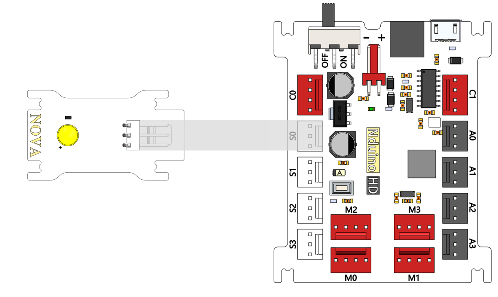
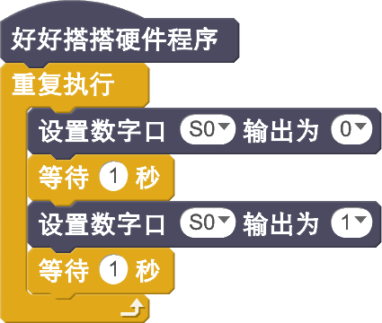
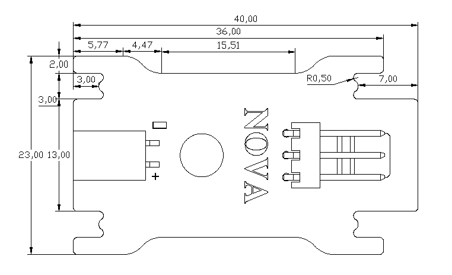

# LED模块说明

## 概述
Nova的LED模块主要实现LED灯的亮度的控制。

## 参数
- 尺寸：40x23mm
- 工作电压：+3.3-5V
- 类型：数字模式
- 接口模式：2510-3p
- 引脚定义：1-控制端 2-电源 3-地

## 接口说明
- 可用端口： A0、A1、A2、A3、S0、S1、S2、S3

## 使用方式

## 示例代码

[LED模块示例代码 ](http://www.haohaodada.com/show.php?id=946933)

## 原理图
[LED模块原理图](https://github.com/Haohaodada-official/haohaodada-docs/blob/master/%E5%8E%9F%E7%90%86%E5%9B%BE/LED%E6%A8%A1%E5%9D%97.pdf)

## 尺寸说明

## 常见问题