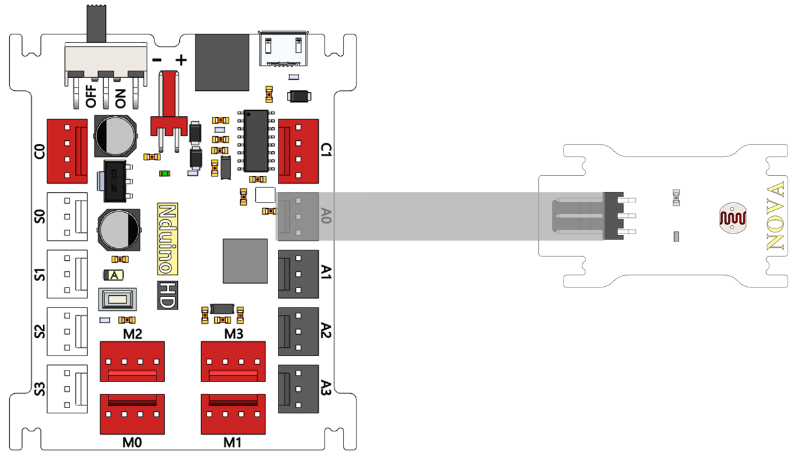
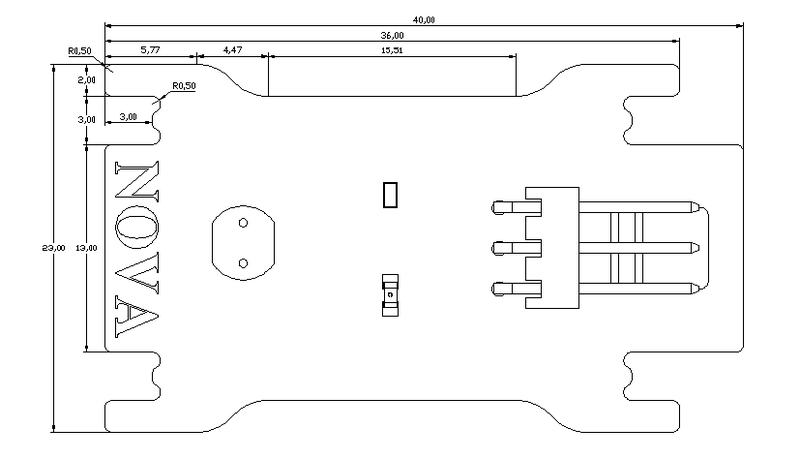

# 亮度传感器模块

## 概述

NOVA光敏传感器以模拟量输出，光线越强AD采样值越大，反之越小。

## 参数

* 尺寸：40x23mm
* 检测环境光密度
* 环保光敏二极管
* 模拟输出电压：0~5 VDC
* 适用电源电压：+3~5VDC
* 模拟传感器
* 传感器匹配Arduino扩展板
* 接口模式：2510-3p
* 引脚定义：1-控制端 2-电源 3-地

## 接口说明

* 可用端口： A0、A1、A2、A3

## 使用方式

## 示例代码

[亮度传感器模块示例代码](http://www.haohaodada.com/show.php?id=947651)

## 原理图

[亮度传感器模块原理图](https://github.com/Haohaodada-official/docs/blob/master/jiao-xue-chan-pin/pdf/yuan-li-tu/光线传感器模块.pdf)

## 尺寸说明

## 相关资源

[光敏电阻数据手册](https://github.com/Haohaodada-official/docs/blob/master/jiao-xue-chan-pin/pdf/xin-pian-shuo-ming/亮度-光敏电阻.PDF)

## 常见问题

