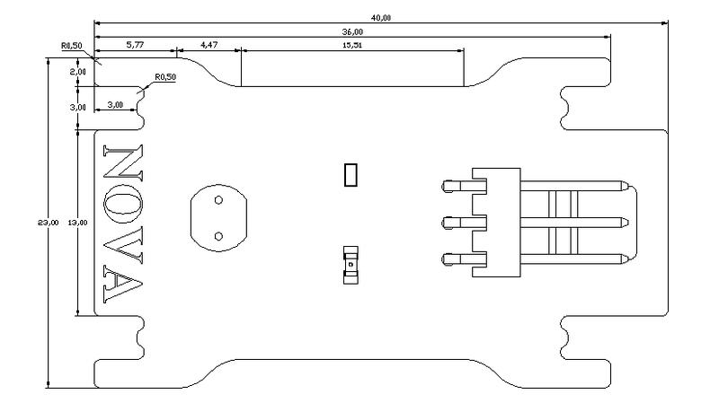

# 亮度传感器模块说明

## 概述
NOVA光敏传感器以模拟量输出，光线越强AD采样值越大，反之越小。

## 参数
- 尺寸：40x23mm
- 检测环境光密度
- 环保光敏二极管
- 模拟输出电压：0~5 VDC
- 适用电源电压：+3~5VDC
- 模拟传感器
- 传感器匹配Arduino扩展板
- 接口模式：2510-3p
- 引脚定义：1-控制端 2-电源 3-地

## 接口说明
- 可用端口： A0、A1、A2、A3

## 使用方式

## 示例代码

[亮度传感器模块示例代码](http://www.haohaodada.com/show.php?id=947651)

## 原理图
[亮度传感器模块原理图](https://github.com/Haohaodada-official/haohaodada-docs/blob/master/%E5%8E%9F%E7%90%86%E5%9B%BE/%E5%85%89%E7%BA%BF%E4%BC%A0%E6%84%9F%E5%99%A8%E6%A8%A1%E5%9D%97.pdf)

## 尺寸说明

## 相关资源

[光敏电阻数据手册](https://github.com/Haohaodada-official/haohaodada-docs/blob/master/%E4%B8%BB%E8%A6%81%E8%8A%AF%E7%89%87%E8%AF%B4%E6%98%8E%E4%B9%A6/%E4%BA%AE%E5%BA%A6-%E5%85%89%E6%95%8F%E7%94%B5%E9%98%BB.PDF)

## 常见问题
