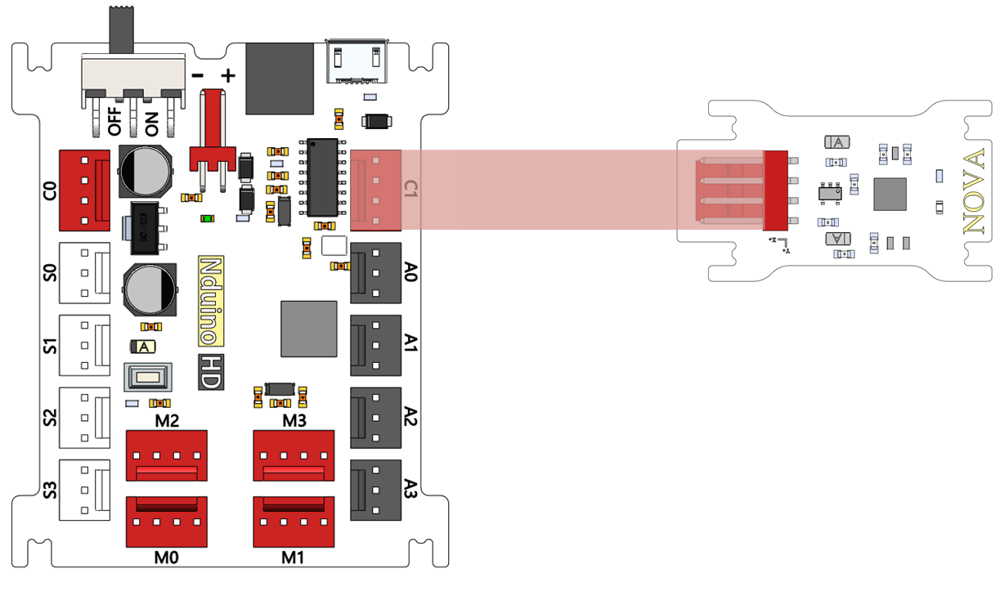
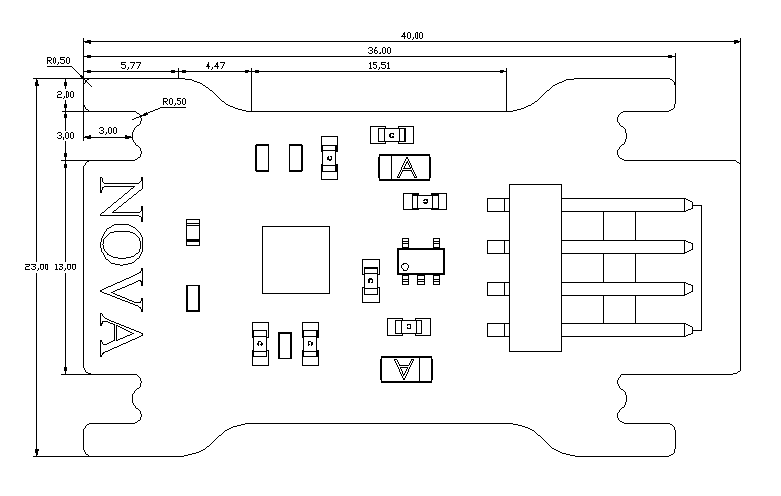

# 陀螺仪模块说明

## 概述
NOVA陀螺仪传感器采用MPU6050芯片，它是一种非常流行的空间运动传感器芯片，可以获取器件当前的三个加速度分量和三个旋转角速度。由于其体积小巧，功能强大，精度较高，不仅被广泛应用于工业，同时也是航模爱好者的神器，被安装在各类飞行器上驰骋蓝天。

## 参数
- 尺寸：40x23mm
- 六轴运动处理组件，三个加速度分量有4个倍率可选：2g、4g、8g、16g。
- 供电电压3.3V，MPU6050芯片内自带一个数据处理子模块DMP，已经内置了卡尔曼滤波算法，在许多应用中使用DMP输出的数据已经能够很好的满足要求。
- 接口模式：2510-4p
- 引脚定义：1、2-控制端 3-电源 4-地

## 接口说明
- 可用端口： C0、C1、M0、M1、M2、M3

## 使用方式

## 示例代码

[陀螺仪模块示例代码](http://www.haohaodada.com/show.php?id=950120)

## 原理图
[陀螺仪模块原理图](https://github.com/Haohaodada-official/haohaodada-docs/blob/master/%E5%8E%9F%E7%90%86%E5%9B%BE/%E9%99%80%E8%9E%BA%E4%BB%AA%E6%A8%A1%E5%9D%97.pdf)

## 尺寸说明

## 相关资源

[MPU6050芯片手册](https://github.com/Haohaodada-official/haohaodada-docs/blob/master/%E4%B8%BB%E8%A6%81%E8%8A%AF%E7%89%87%E8%AF%B4%E6%98%8E%E4%B9%A6/%E9%99%80%E8%9E%BA%E4%BB%AA-MPU6050.PDF)

## 常见问题
