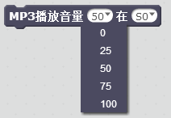
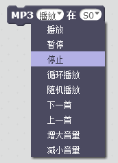
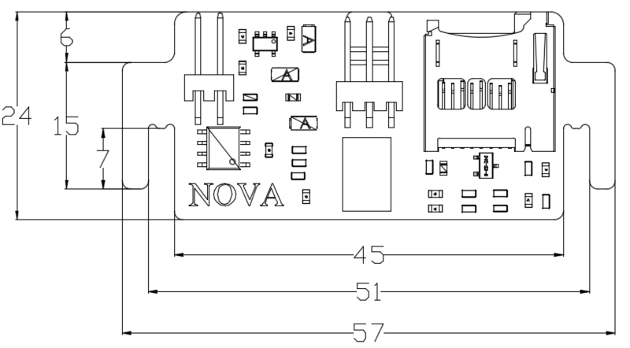

# MP3音乐模块

## 概述

NOVA的MP3模块是一款可以播放歌曲的模块，采用语音芯片YX5200进行解析音乐文件，通过喇叭发出音乐。

## 参数

* 尺寸：57x24mm
* 电源要求：+5V
* 类型：模拟模式
* 接口模式：2510-3p
* 引脚定义：1-控制端 2-电源 3-地

## 接口说明

* 可用端口： A0、A1、A2、A3、S0、S1、S2、S3

## 使用方式

[nova制作控制mp3视频](http://www.haohaodada.com/art_show.php?id=149)

SD 卡内部 mp3 文件设置：

MP3 使用说明: SD 卡内部新建文件夹，将其命名为 mp3。 mp3 文件夹内部放置音乐，音乐文件后缀支持.mp3 及.wav 后缀名。内部放置音乐文件命名必须以 0001 开头，最多支持 65536 首曲目。

程序说明：

mp3 程序块有三个，分别为音量设置，指定曲目播放和播放模式设定。

音量设置一般放置在初始化中，设定音量 0~100，根据实际需要设置即可。

指定播放曲目需按照 SD 卡内部 MP3 音乐设置，mp3 文件夹内部设置 0001.mp3 曲目设置即可设置第一首，mp3 文件夹内部有 0255.mp3 曲目设置就可播放 255，如图所示

播放模式设定： 播放模式可以选择五种状态：播放模式选择播放即单曲循环文件夹内部第一首曲目；循环播放模式即为循环播放文件夹内部全部曲目；随机播放模式为随机播放文件夹内部曲目；暂停 是暂停当前曲目，当下一个播放命令执行时继续播放当前曲目；停止模式是停止播放。 播放方式还可选择4中方式：上一首即为播放编号排序上一首的曲目；下一首即为播放拨号排序下一首的曲目；增大音量一次即可增大一度音量；减小音量一次即可见效一度音量。

## 示例代码

[MP3音乐模块示例代码](http://www.haohaodada.com/show.php?id=947296)

## 原理图

[MP3音乐模块原理图](https://github.com/Haohaodada-official/docs/blob/master/jiao-xue-chan-pin/pdf/yuan-li-tu/MP3%E9%9F%B3%E4%B9%90%E6%A8%A1%E5%9D%97.pdf)

## 尺寸说明

## 常见问题

