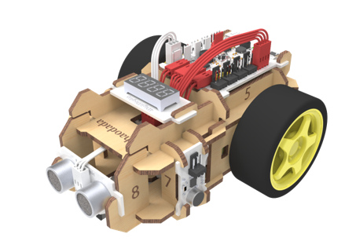
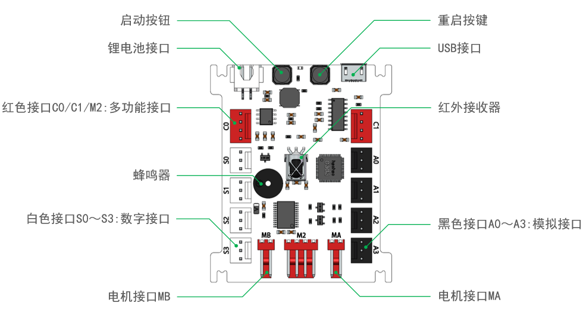
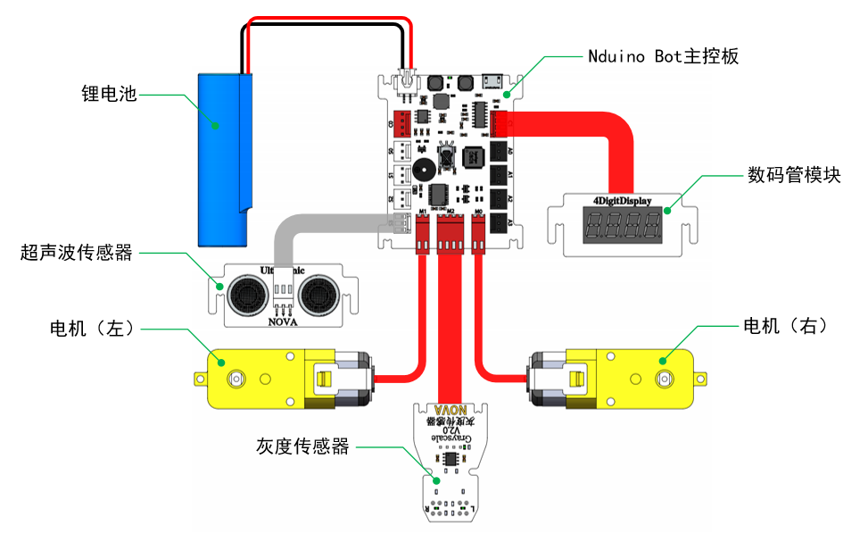

# Nduino BOT

## 概述

Nduino Bot主板是专为小车而设计，在延续了HD主板设计理念的同时，集成了锂电池管理、红外接收、蜂鸣器、双路电机驱动、启动按键、电源开关。

## 参数

* 输入电压：3.7V锂电池
* 输出能力：5V 1A
* 控制芯片：32位好搭定制ARM芯片 
* 尺        寸：66 x 55 x 15 mm\(L x W x H\)

## 接口说明

## 接线方式

## 使用方式

[Nova小车编程模板](http://haohaodada.com/show.php?id=581529)

## 相关资源

[NOVA智能小车V3.0使用说明书](https://github.com/Haohaodada-official/docs/blob/master/jiao-xue-chan-pin/nova-module/pdf/NOVA智能小车V3.0使用说明书.pdf)

[基于Scratch的智能小车编程-V4](https://github.com/Haohaodada-official/docs/blob/master/jiao-xue-chan-pin/nova-module/pdf/基于Scratch的智能小车编程-V4.pdf)

## 常见问题

