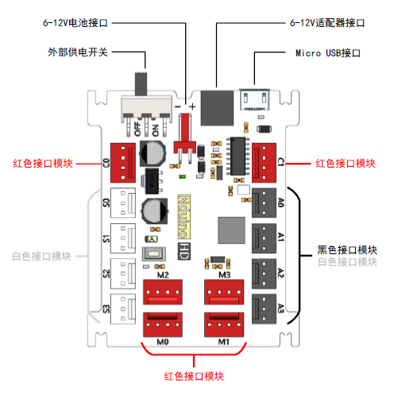

# Nduino HD

## 概述

Nova是一款专门面向少年儿童创客设计、开发的开源硬件，使用它可以非常方便、快速的造物，制作各种智能装置。和Arduino开源硬件的区别是，更适合入门，能让孩子快速的实现创意，而不是被一些接线等奇奇怪怪的问题搞的失去兴趣。可以作为学过Scratch传感器板后的进阶套件。

## 特点

* 用颜色重新定义的防反插接口
* 优化电源设计，最大限度保证稳定性
* 卡槽外形设计，适配激光切割结构件

## 参数

* 输入电压：6-12V
* 输出能力：5V 1.5A
* 控制芯片：32位好搭定制ARM芯片 
* 尺寸：66 x 55 x 15 mm\(L x W x H\)

## 接口说明

1.白色接口模块可以连接Nduino 的白色接口S0-S3，也可以连接主控板的黑色接口A0-A3；

2.黑色接口模块只能连接Nduino 的黑色接口A0-A3。

3.红色接口模块连接Nduino 的红色接口。

## 供电方案

1.Micro USB 连接可以为Nduino 提供5V 电压和最大500mA 电流。

2.由电源适配器（9V1A）或外接电池（电压6V 以上）供电，红色端口的电源VE等于外接电源电压。

## 教程

[NOVA标准课程教程](https://github.com/Haohaodada-official/docs/blob/master/jiao-xue-chan-pin/nova-module/pdf/NOVA%E6%A0%87%E5%87%86%E8%AF%BE%E7%A8%8B%E6%95%99%E7%A8%8B%EF%BC%88HD%E7%89%88%20%E7%AC%AC%E4%B8%80%E7%A8%BF%EF%BC%89.pdf)

[基于Scratch的Arduino智能造物入门](https://docs.haohaodada.com/~/revisions/-LaJ8JiDM62JyESt8TJM/zai-xian-ru-men-ke-cheng/scratch-arduino-primer)

## 原理图

[Nduino HD原理图](https://github.com/Haohaodada-official/docs/blob/master/jiao-xue-chan-pin/nova-module/pdf/02010002-Nduino%20HD.pdf)

