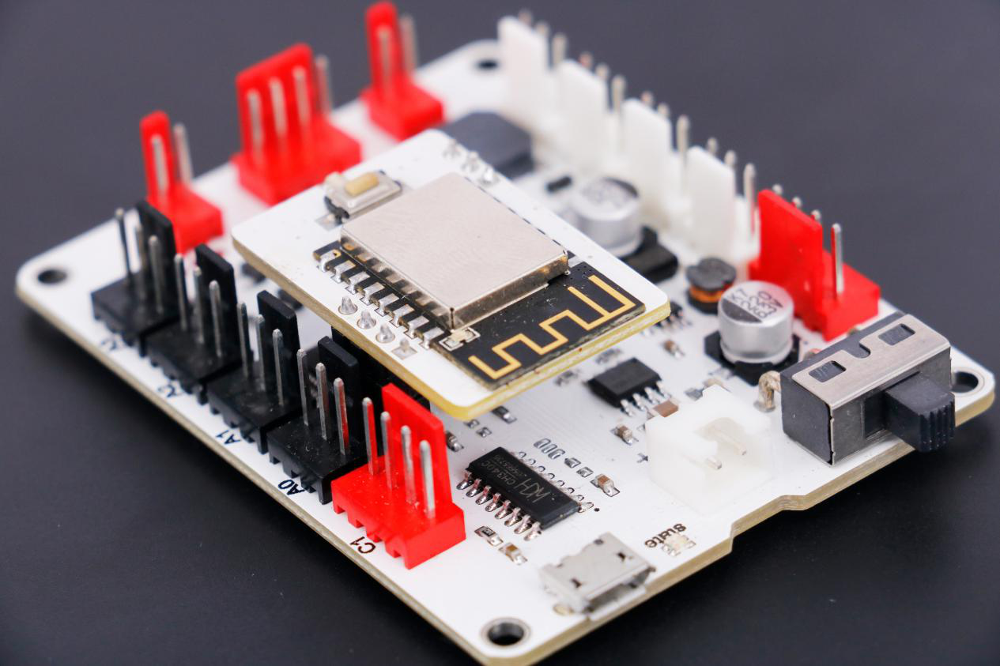

# Nduino-Wulink

## 概述
WULink-Nova是在nova的HD板与小车板的基础之上，增加了无线网卡，集云编程、无线下载、物联网通讯功能于一体，不仅可以快速造物，还能进行物联网开发，使用更加方便有趣。

## 特色
- 用颜色重新定义的防反插接口
- 优化电源设计，最大限度保证稳定性
- 物联网相关设置通讯简单，便于快速上手

## 参数
- 输入电压：3.7V锂电池
- 输出能力：5V 1A
- 控制芯片：32位好搭定制ARM芯片 
- 尺寸：70 x 54 x 15 mm(L x W x H)

## 接口说明

1.白色接口模块可以连接WULink-Nova的白色接口S0-S3，也可以连接主控板的黑色接口A0-A3；

2.黑色接口模块只能连接WULink-Nova的黑色接口A0-A3。

3.红色接口模块连接WULink-Nova的红色接口。

## 供电方式
1.Micro USB 连接供电。

2.3.7v锂电池供电。

## 使用方式
网络配置：按住WIFI配置键开机，蜂鸣器响一声，WIFI配置指示灯红色常亮，进入好好搭搭微信公众号的好搭物联网小程序进行配置，配置成功后指示灯变蓝色。

## 原理图

[KT-Board原理图]()
[WIFI module原理图]()

## 常见问题
1.微信配置不上网络

请尝试用WEB方式配置。

2.配置网络的原理是什么

通过手机把我们的路由器的网络账号告诉WU-Link，让她能顺利的连上网络

3.一个路由器最多能带几台设备

一般路由建议不要超过10台设备。

4.怎么解绑MAC地址
在原来绑定的账号里删除即可，如果忘记原来帐号，请联系技术支持。