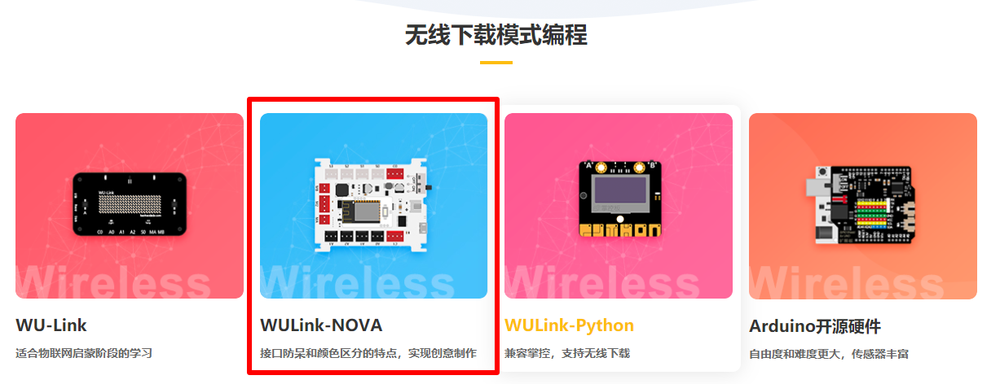
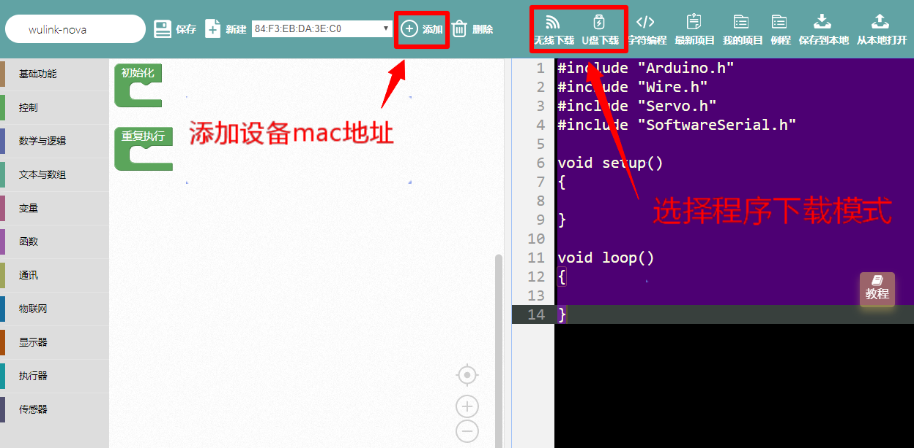
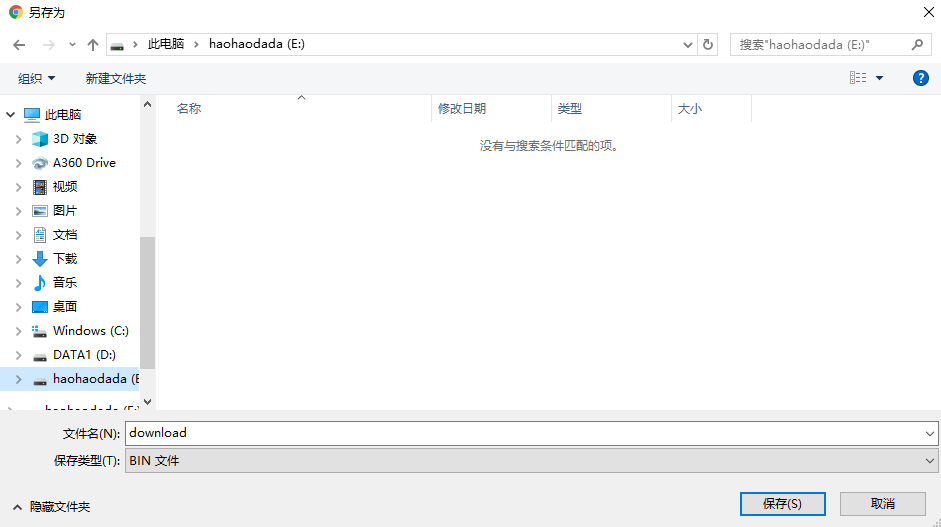

# Nduino-Wulink

## 概述

Nduino-Wulink是在nova的BOT板的基础之上，增加了无线网卡，集云编程、无线下载、物联网通讯功能于一体，还将原来的USB下载模式改为U盘下载模式，不仅可以快速造物，还能进行物联网开发，使用更加方便有趣。

## 特色

* 用颜色定义的防反插接口
* 优化电源设计，最大限度保证稳定性
* 物联网相关设置通讯简单，便于快速上手

## 参数

* 输入电压：3.7V锂电池
* 输出能力：5V 1A
* 控制芯片：32位好搭定制ARM芯片 
* 尺        寸：70 x 54 x 15 mm\(L x W x H\)

## 接口说明

1.白色接口模块可以连接Nduino-Wulink的白色接口S0-S3，也可以连接主控板的黑色接口A0-A3；

2.黑色接口模块只能连接Nduino-Wulink的黑色接口A0-A3。

3.红色接口模块连接Nduino-Wulink的红色接口。

## 供电方式

1.Micro USB 连接供电。

2.3.7v锂电池供电。

## 使用方式

进入好好搭搭新版网站并进入创作界面，选择WULink-Nova编程界面。

Nduino-Wulink下载程序有wifi下载和U盘下载两种模式。

wifi下载模式：

1.连接wifi下载模块。

2.进行网络配置，按住WIFI配置键开机，蜂鸣器响一声，WIFI配置指示灯红色常亮，再按一下WIFI配置键，蜂鸣器长响一声，设备进入WIFI配置模式，进入好好搭搭微信公众号的好搭物联网小程序进行配置，配置成功后指示灯变蓝色。进行网络配置，按住WIFI配置键开机，蜂鸣器响一声，WIFI配置指示灯红色常亮，进入好好搭搭微信公众号的好搭物联网小程序进行配置，配置成功后指示灯变蓝色。

3.配置成功后，回到编程界面，添加设备mac地址，编写程序并点击“无线下载”，程序下载成功后浏览器弹出对话框提示下载成功，设备蜂鸣器滴滴滴响几声，即下载程序成功。

U盘下载模式：

1.将主板与电脑连接，电脑显示U盘：

2.回到编程界面，编写程序，点击“U盘下载”选择下载路径为haohaodada U盘，点击保存即可下载。

## 原理图

## 常见问题

1.微信配置不上网络

请尝试用WEB方式配置。

2.配置网络的原理是什么

通过手机把我们的路由器的网络账号告诉WU-Link，让她能顺利的连上网络

3.一个路由器最多能带几台设备

一般路由建议不要超过10台设备。

4.怎么解绑MAC地址 在原来绑定的账号里删除即可，如果忘记原来帐号，请联系技术支持。

