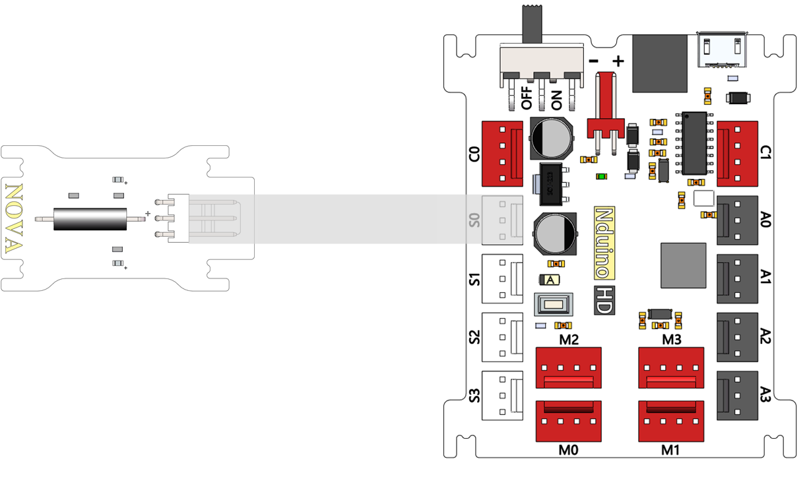
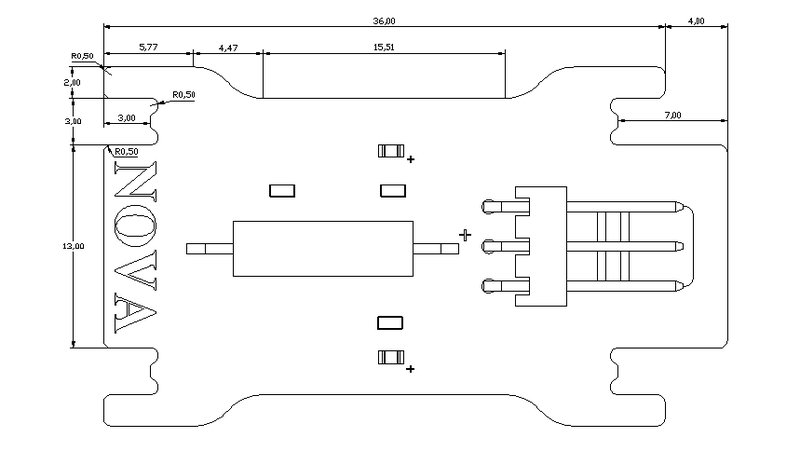

# 倾斜开关模块说明

## 概述
NOVA的倾斜开关SW-200D，一端是金色导针，是导通触发端；另一端是银色导针，是开路端。当外力使倾斜开关里面的滚珠滚到金色一端，则倾斜开关导通，绿色LED状态指示灯灭，输出高电平；滚到银色一端则断开，绿色LED状态指示灯亮，输出低电平。

## 参数
- 输入电压：5V
- 尺寸：40x23mm
- 钢球开关模块角度：2-5度
- 接口模式：2510-3p
- 引脚定义：1-控制端 2-电源 3-地

## 接口说明
- 可用端口： A0、A1、A2、A3、S0、S1、S2、S3

## 使用方式

## 示例代码

[倾斜开关模块示例代码](http://www.haohaodada.com/show.php?id=947645)

## 原理图
[倾斜开关模块原理图](https://github.com/Haohaodada-official/haohaodada-docs/blob/master/%E5%8E%9F%E7%90%86%E5%9B%BE/%E5%80%BE%E6%96%9C%E5%BC%80%E5%85%B3%E6%A8%A1%E5%9D%97.pdf)

## 尺寸说明

## 常见问题
