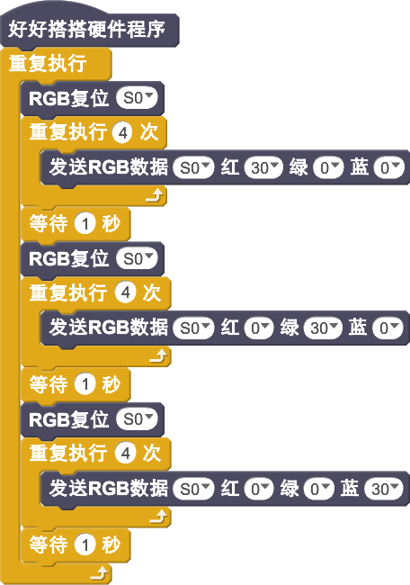

# RGB模块说明

## 概述
Nova的RGB模块主要实现LED灯的各种颜色、亮度的控制，从而产生绚丽的灯光效果。
RGB灯采用WS2812B，它是一个集控制电路与发光电路于一体的智能外控LED光源，5050封装，每个元件即为一个像素点。像素点内部包含了智能数字接口数据锁存信号整形放大驱动电路,还包含有高精度的内部振荡器和可编程定电流控制部分，有效保证了像素点光的颜色高度一致。数据协议采用单线归零码的通讯方式，像素点在上电复位以后，DIN端接受从控制器传输过来的数据，首先送过来的24bit数据被第一个像素点提取后，送到像素点内部的数据锁存器，剩余的数据经过内部整形处理电路整形放大后通过DO端口开始转发输出给下一个级联的像素点，每经过一个像素点的传输，信号减少24bit。像素点采用自动整形转发技术，使得该像素点的级联个数不受信号传送的限制，仅仅受限信号传输速度要求。
LED具有低电压驱动，环保节能，亮度高，散射角度大，一致性好，超低功率，超长寿命等优点。将控制电路集成于LED上面，电路变得更加简单，体积小，安装更加简便。

## 参数
- 尺寸：40x23mm
- 电源要求：3.5-5.3V
- 逻辑输入电压：-0.5-VDD+0.5V
- 工作温度-25-80℃
- 振荡频率典型值800KHz
- 接口模式：2510-3p
- 引脚定义：1-控制端 2-电源 3-地

## 接口说明
- 可用端口： A0、A1、A2、A3、S0、S1、S2、S3

## 使用方式

## 示例代码

[RGB模块示例代码](http://www.haohaodada.com/show.php?id=947337)

## 原理图
[RGB模块原理图](https://github.com/Haohaodada-official/haohaodada-docs/blob/master/%E5%8E%9F%E7%90%86%E5%9B%BE/RGB%E7%81%AF%E6%A8%A1%E5%9D%97.pdf)

## 尺寸说明

## 常见问题
