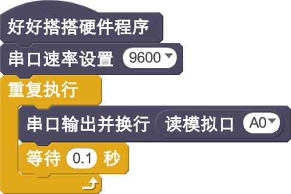
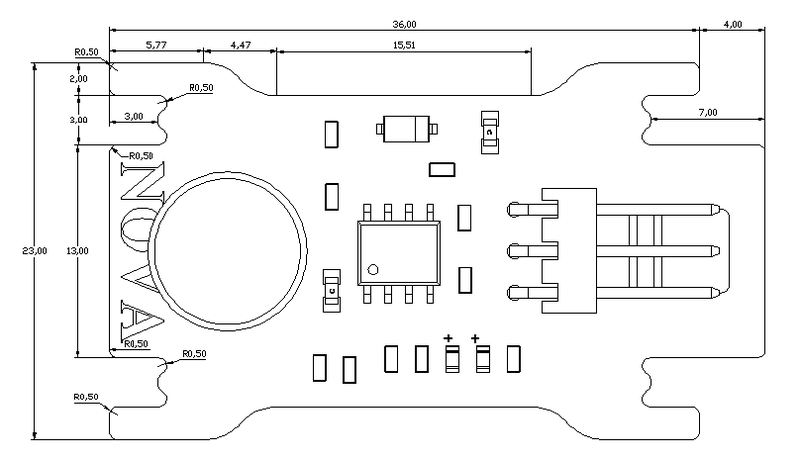

# 声音传感器模块说明

## 概述
NOVA的声音模块采用咪头采集声音信号并转化成高低电平脉冲，这个电平脉冲再经过LM2904运算放大器放大输出，输出大于一定阈值就能点亮绿色LED，LED随着声音强度亮灭，声音越大，LED越亮。

## 参数
- 尺寸：40x23mm
- 工作电压：5V
- 工作电流：<10mA
- 最长相应时间：220ms
- 具有输出大小调节
- 接口模式：2510-3p
- 引脚定义：1-控制端 2-电源 3-地

## 接口说明
- 可用端口： A0、A1、A2、A3

## 使用方式

## 示例代码

[声音传感器模块示例代码](http://www.haohaodada.com/show.php?id=947651)

## 原理图
[声音传感器模块原理图](https://github.com/Haohaodada-official/haohaodada-docs/blob/master/%E5%8E%9F%E7%90%86%E5%9B%BE/%E5%A3%B0%E9%9F%B3%E4%BC%A0%E6%84%9F%E5%99%A8%E6%A8%A1%E5%9D%97.pdf)

## 尺寸说明

## 相关资源

[LM2904芯片手册](https://github.com/Haohaodada-official/haohaodada-docs/blob/master/%E4%B8%BB%E8%A6%81%E8%8A%AF%E7%89%87%E8%AF%B4%E6%98%8E%E4%B9%A6/%E5%A3%B0%E9%9F%B3-LM2904.PDF)

## 常见问题
