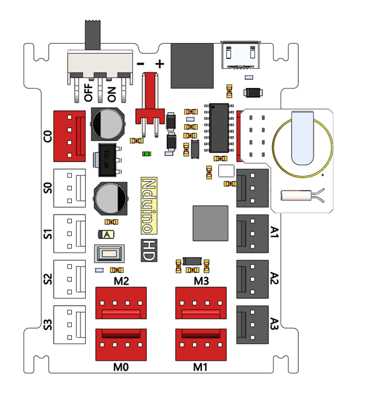
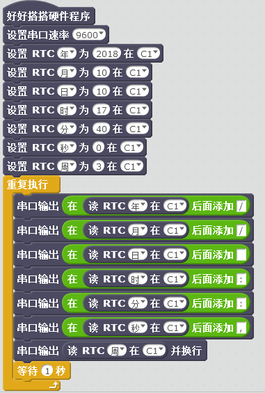
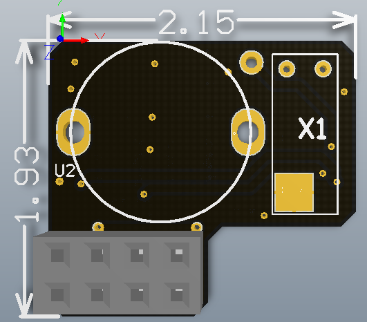

# 时钟模块说明

## 概述
时钟RTC模块，可以实现实时时钟功能，就是像时钟一様可以输出实际时间的电子设备。目前实时时钟芯片大多采用精度较高的晶体振荡器作为时钟源，我们采用DS1307时钟芯片，32.768KHz圆柱体晶振作为时钟源。

## 参数
- 工作电压：5V
- 通信接口：I2C/IIC（Gravity PH2.0-4P接口 & 排针）
- 芯片可输出数据：年、月、日、星期、时、分、秒。
- 自动闰年补偿计算
- 保证准确日期到2100年
- 1Hz输出插口
- 56字节的非易失性内存
- 4KB的只读内存（EEPROM
- 消耗功耗低，有时会比其他方式的输出时钟要更准确。
- DS1307时钟芯片，输入电压4.5-5.5V，典型值5.0V。I2C接口，SCL，SDA引脚电压5V。SQW/OUT（方波/输出驱动）引脚当启用时，位设置为1，该引脚输出四个方波频率（1Hz、4kHz，8kHz，32kHz）。SQW /引脚是开漏输出所以需要外部上拉电阻。该引脚可以在电源或者电池供电下都能工作。
- 32.768KHz圆柱体晶振，圆柱插件3*8规格，精度10PPM。
- 电池电压2.0-3.5V,采用CR1220纽扣电池，标称电压3.0V。

## 接口说明
- 可用端口： C0、C1、M0、M1、M2、M3

## 使用方式

## 示例代码

[时钟模块示例代码](http://www.haohaodada.com/show.php?id=955399)

## 原理图
[时钟模块原理图](https://github.com/Haohaodada-official/haohaodada-docs/blob/master/%E5%8E%9F%E7%90%86%E5%9B%BE/%E6%97%B6%E9%92%9F%E6%A8%A1%E5%9D%97.pdf)

## 尺寸说明

## 相关资源

[DS1307芯片手册](https://github.com/Haohaodada-official/haohaodada-docs/blob/master/%E4%B8%BB%E8%A6%81%E8%8A%AF%E7%89%87%E8%AF%B4%E6%98%8E%E4%B9%A6/%E6%97%B6%E9%92%9F-DS1307.PDF)

## 常见问题
