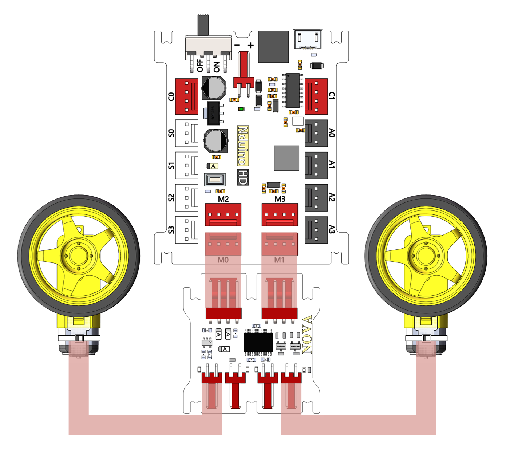

# 双路电机驱动模块

## 概述

NOVA的双路电机模块，每个驱动模块可以实现两路电机的同方向控制，支持高低电平控制、PWM调速控制。模块可以连续输出最高1.2A的驱动电流，最大峰值电流为2A，所以模块上在同一路并了两个直流电机，另一路也放了两个电极。同一路的两个电极方向和速度一样。板上有电机正负方向转动指示灯。

## 参数

* 尺寸：40.1x39mm
* TB6612FNG是一款新型直流电机驱动器，它具有集成度高、驱动能力强以及控制方式灵活等特点，具有大电流MOSFET-H桥结构，双通道电路输出，每通道可以连续输出最高1.2A的驱动电流，启动峰值电流可达2A/3.2A，电机控制模式有正转、反转、制动、停止。PWM支持频率高达100KHz。有待机状态，片内低压检测电路与热停机保护电路。
* 接口模式：2510-4p
* 引脚定义：1、2-控制端 3-电源 4-地

## 接口说明

* 可用端口： M0、M1、M2、M3

## 使用方式

## 示例代码

[双路电机驱动模块示例代码](http://www.haohaodada.com/show.php?id=950085)

## 原理图

[双路电机驱动模块原理图](https://github.com/Haohaodada-official/docs/blob/master/jiao-xue-chan-pin/pdf/yuan-li-tu/%E5%8F%8C%E8%B7%AF%E7%94%B5%E6%9C%BA%E9%A9%B1%E5%8A%A8%E6%A8%A1%E5%9D%97.pdf)

## 尺寸说明

## 相关资源

[TB6612FNG芯片手册](https://github.com/Haohaodada-official/docs/blob/master/jiao-xue-chan-pin/pdf/xin-pian-shuo-ming/%E5%8F%8C%E8%B7%AF%E7%94%B5%E6%9C%BA-TB6612FNG.PDF)

## 常见问题

