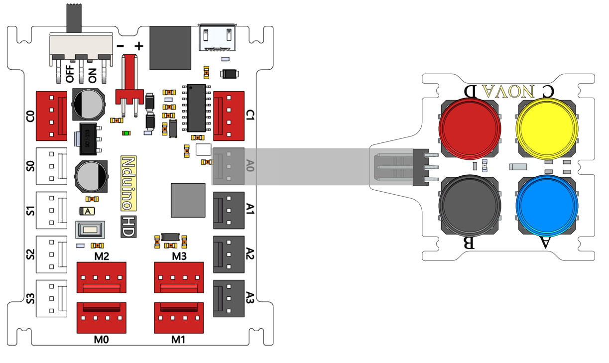
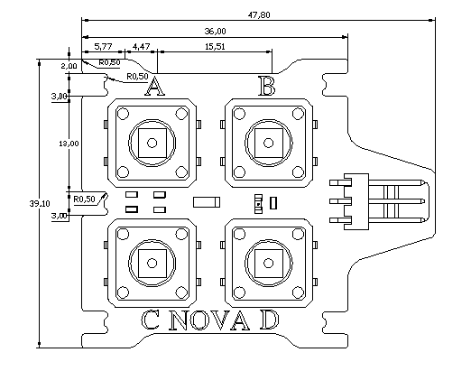

# 四按键模块说明

## 概述
NOVA的四按键模块，是通过AD采样实现的 ，所以只能接在模拟口。每个按键对应一个AD采样值（不同的输出电压值），从而实现不同按键的判别。

## 参数
- 输入电压：5V
- 工作电压：控制器工作电压
- 数据类型：模拟信号
- 尺寸：47.8x39.1mm
- 接口模式：2510-3p
- 引脚定义：1-控制端 2-电源 3-地

## 接口说明
- 可用端口： A0、A1、A2、A3

## 使用方式

## 示例代码

[四按键模块示例代码](http://www.haohaodada.com/show.php?id=947651)

## 原理图
[四按键模块原理图](https://github.com/Haohaodada-official/haohaodada-docs/blob/master/%E5%8E%9F%E7%90%86%E5%9B%BE/%E5%9B%9B%E6%8C%89%E9%94%AE%E6%A8%A1%E5%9D%97.pdf)

## 尺寸说明

## 常见问题
