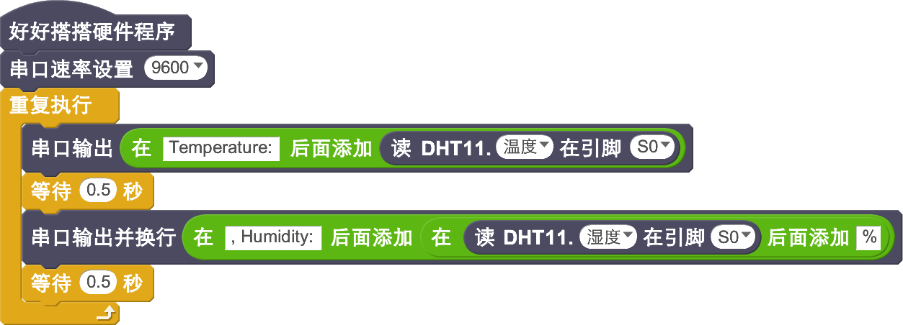

# 温湿度模块

## 概述

NOVA温湿度模块采用的是DHT11传感器，可以用来同时测量温度和湿度。

## 参数

* 供电电压：+5V
* 尺寸：40x23mm
* 接口类型：数字
* 温度范围：0-50℃ 误差±2℃
* 湿度范围：20-90%RH 误差±5%RH
* 接口模式：2510-3p
* 引脚定义：1-控制端 2-电源 3-地

## 接口说明

* 可用端口： A0、A1、A2、A3、S0、S1、S2、S3

## 使用方式

## 示例代码

[温湿度模块示例代码](http://www.haohaodada.com/show.php?id=950150)

## 原理图



## 尺寸说明

## 相关资源



## 常见问题

