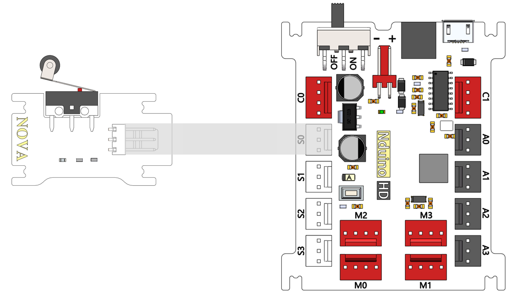
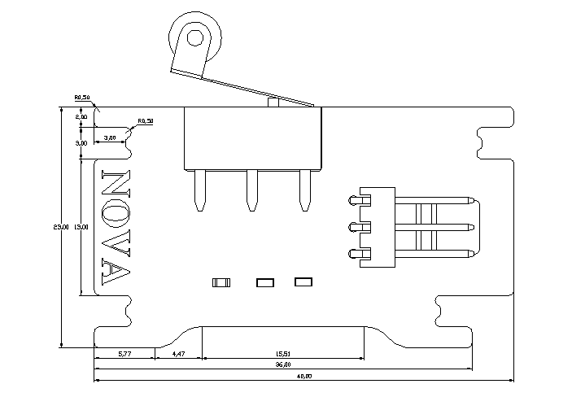

# 限位开关模块

## 概述

NOVA的限位开关模块，开关没有触碰时输出高电平，绿色LED状态指示灯灭；触碰时输出低电平，绿色LED状态指示灯亮。

## 参数

* 输入电压：5V
* 尺寸：40x23mm
* 限位开关有三个引脚，一个是公共端，一个是常闭脚，另一个是常开脚。没按下时是常闭闭合，常开断开；按下时是常开的闭合，常闭的断开。
* 接口模式：2510-3p
* 引脚定义：1-控制端 2-电源 3-地

## 接口说明

* 可用端口： A0、A1、A2、A3、S0、S1、S2、S3

## 使用方式

## 示例代码

[限位开关模块示例代码](http://www.haohaodada.com/show.php?id=947645)

## 原理图



## 尺寸说明

## 常见问题

