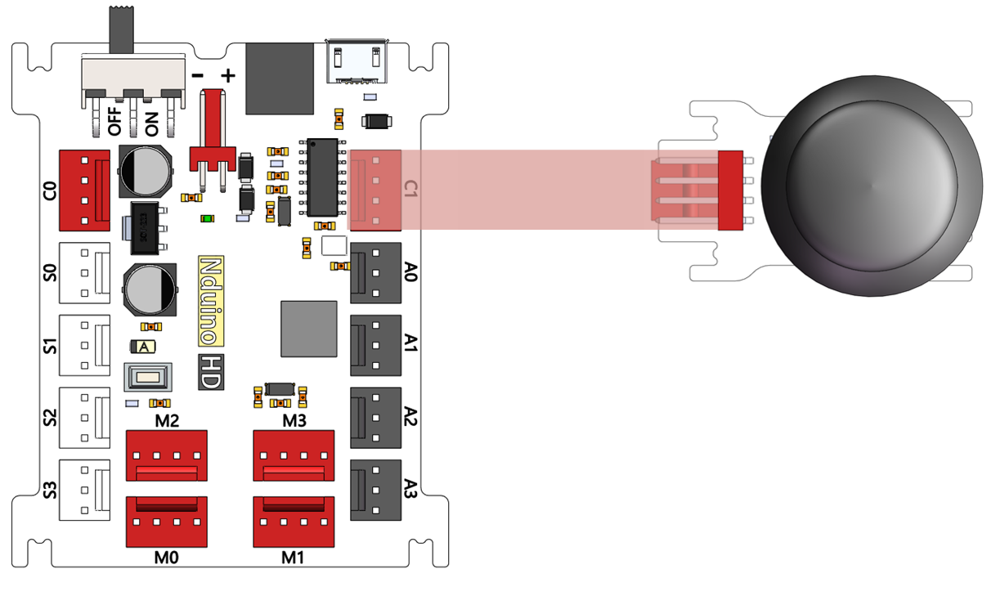
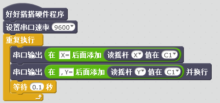
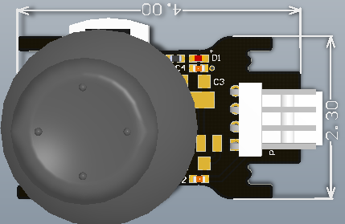

# 摇杆模块

## 概述

摇杆模块可以调节输出电压，其实就是一个摇杆电位计。利用这个可以做很多应用，比如四轴飞行器的遥控手柄等。摇杆电位计内部其实是两个电位计，定义成X、Y方向。上、下方向调节一个电位器的阻值，左、右方向调节另外一个电位器的阻值。当拨杆在没有动作时处在中间位置，也就是阻值的中间值，所以用串口输出电压值时，中间是512左右，两端是0~1023。

## 参数

* 尺寸：40x23mm
* 电源要求：5V
* 接口模式：2510-4p
* 引脚定义：1、2-控制端 3-电源 4-地

## 接口说明

* 可用端口： C1

## 使用方式

## 示例代码

[摇杆模块示例代码](http://www.haohaodada.com/show.php?id=950162)

## 原理图



## 尺寸说明

## 常见问题

