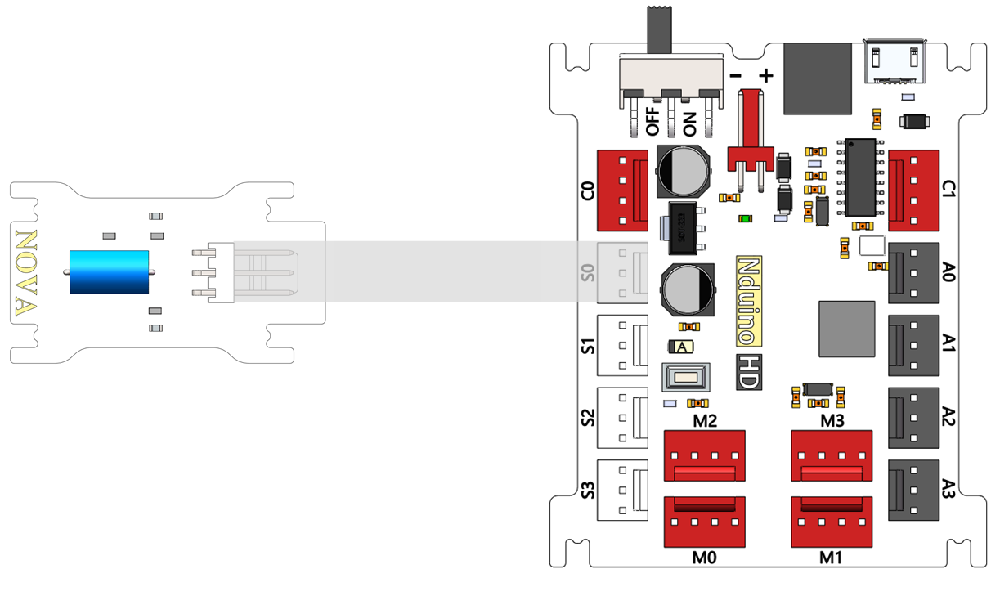
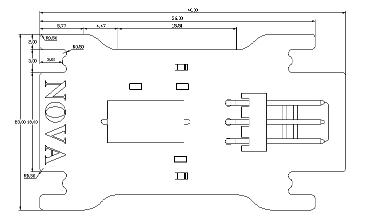

# 震动开关模块说明

## 概述
NOVA的震动模块SW420，是一种常闭开关。有震动时开关内部断开，输出低电平，绿色LED状态指示灯亮；没震动时开关内部闭合，输出高电平，绿色LED状态指示灯灭。

## 参数
- 输入电压：5V
- 尺寸：40x23mm
- 在外力震动时，达到适当的震动力时导电针将瞬间开启（ON）。
- 无方向，任何角度可能检测震动。
- 适用于小电流电路（二次回路）或触发（IC）。
- 在室温和正常使用情况下的开关使用寿命可达10万次（times/1sec）。
- 供电电压：和所用控制器一致即可。
- 开启时间：0.1ms（建议使用中断捕捉）
- 开路电阻：10Mohm
- 平时保持高电平输出，震动时输出低电平。

## 接口说明
- 可用端口： A0、A1、A2、A3、S0、S1、S2、S3

## 使用方式

震动开关内部结构：

## 示例代码

[震动开关模块示例代码](http://www.haohaodada.com/show.php?id=947645)

## 原理图
[震动开关模块原理图](https://github.com/Haohaodada-official/haohaodada-docs/blob/master/%E5%8E%9F%E7%90%86%E5%9B%BE/%E9%9C%87%E5%8A%A8%E5%BC%80%E5%85%B3%E6%A8%A1%E5%9D%97.pdf)

## 尺寸说明

## 常见问题
