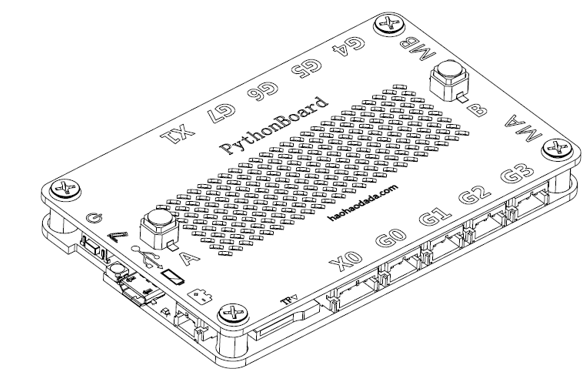
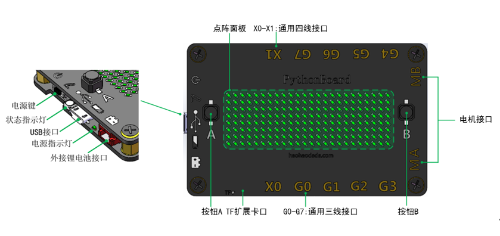
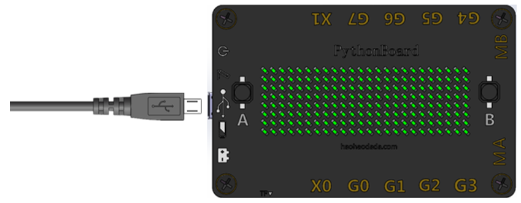
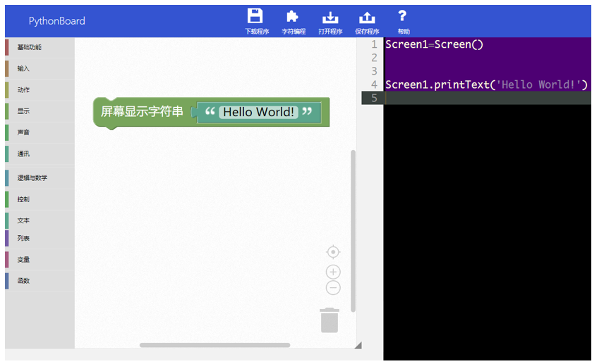
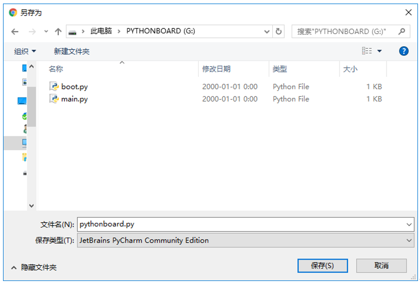

# PythonBoard

## 概述

PythonBoard搭载一颗32位ARM芯片，主频168MHz。采用优盘下载模式。内置指南针、加速度、时钟、按键、8\*24点阵、电机驱动、蜂鸣器、TF卡扩展口、锂电池充放电管理。

内核基于MicroPython优化改良而来，相比于MicroPython，PythonBoard内置了常用的Arduino传感器驱动库，函数接口也参考Arduino的命名规则，弥补了MicroPython传感器驱动匮乏的缺点，适合Arduino玩家快速切换到Python编程上来。

## 参数

* 电池容量：800mAh；
* 充电电压：DC 5V；
* 下载方式：U盘下载
* 接        口：PH-2P，2路电机接口；PH-3P，8路通用接口；PH-4P，2路通讯接口；
* 扩展接口：TF Class 10卡
* 尺        寸：88x56x10mm。

## 接口说明

## 使用方式

Step 1:连接

用micro usb线把PythonBoard和电脑连接起来，支持Mac、Windows、Linux。

你的电脑会显示一个叫“PythonBoard”的磁盘。

Step 2: 编程

浏览器打开网址haohaodada.com/pythonboard。现在我们来写第一个程序。从左侧图形块菜单里找到我们第一个图形块“显示/屏幕显示字符串”，再从“文本”找到如图所示模块，然后写上“Hello World!”

Step 3: 下载

点击“下载程序”按钮，保存文件到“PythonBoard”的磁盘里。

等待状态指示灯的红灯熄灭后，程序便会自动执行。你将看到点阵屏上会从右往左滚动显示 “Hello World！”。

## 原理图

## 教程

[Python硬件套件教程-统稿](https://github.com/Haohaodada-official/docs/blob/master/jiao-xue-chan-pin/pdf/Python硬件套件教程-统稿.pdf)

## 常见问题

1.设备驱动安装，如果电脑没有自动识别安装

可以手动选择更新驱动，然后选择当前U盘内的PythonBoard.inf。

2.恢复出厂设置

按住A按钮不放，然后按下复位按键，松开复位按键，你会看到RGB灯会从红、绿、蓝轮流显示，当显示蓝色时，松开User按钮，稍等片刻即可。

3.进入实时交互模式：

* Windows: 建议使用putty，打开串口，波特率设置为115200。
* Mac OS X: 使用命令: screen /dev/tty.usbmodem\*
* Linux: 使用命令: screen /dev/ttyACM0

