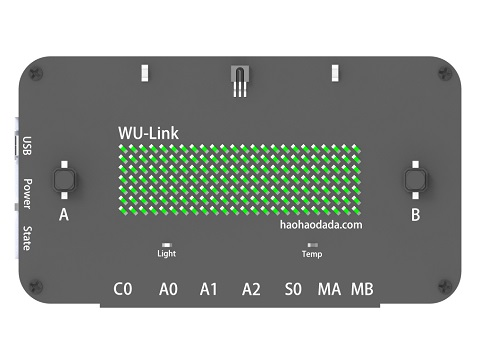
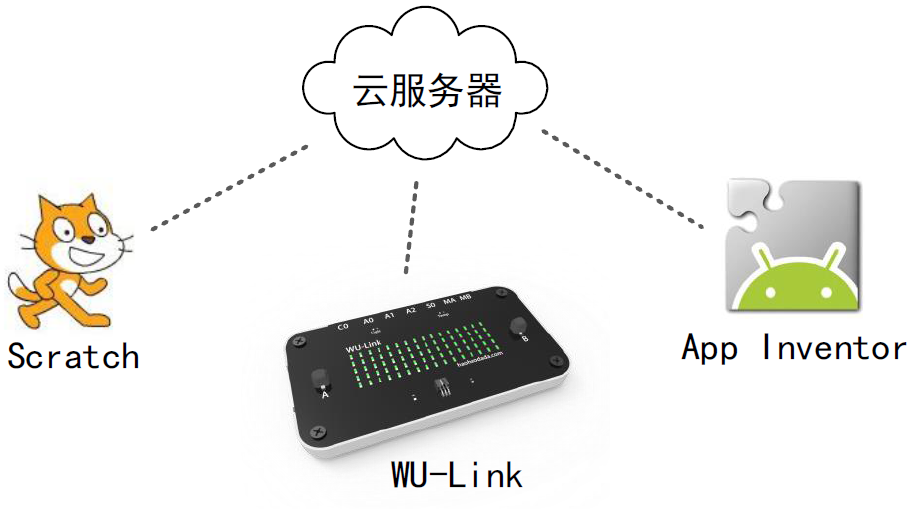

# wulink主板说明   

## 概述
WU-Link 是基于云技术的一款物联网开发板，集云编程、无线下载、物联网通讯功能于一
体，既能实现目前Arduino 常见应用，也能进行物联网应用开发。

WU-Link 板载了亮度、温度、电子罗盘、加速度计、按键、蜂鸣器、红外接收、红外发射、
7×24颗LED、震动反馈。

WU-Link 最大的亮点在于物联网相关的设置与通讯非常简单，让零基础用户能很快的上手。

## 参数
* 电池容量：2200mAh；
* 充电电压：DC 5V；
* 下载方式：无线下载
* 接    口：PH-2P，2路电机接口；PH-3P，3路模拟接口；PH-3P，1路数字接口；PH-4P，1路通讯接口；
* 尺    寸：113x63x10mm。

## 扩展接口说明
[WU-Link扩展接口说明](https://github.com/Haohaodada-official/haohaodada-docs/blob/master/wulink/pdf/WU-Link%E6%89%A9%E5%B1%95%E6%8E%A5%E5%8F%A3%E8%AF%B4%E6%98%8E.pdf) 

## 使用方式
[WU-Link简易教程](https://github.com/Haohaodada-official/haohaodada-docs/blob/master/wulink/pdf/WU-Link%E7%AE%80%E6%98%93%E6%95%99%E7%A8%8B.pdf) 

[WU-Link物联网套件教程-统稿](https://github.com/Haohaodada-official/haohaodada-docs/blob/master/wulink/pdf/WU-Link%E7%89%A9%E8%81%94%E7%BD%91%E5%A5%97%E4%BB%B6%E6%95%99%E7%A8%8B-%E7%BB%9F%E7%A8%BF.pdf) 

## 课程
[WU-Link智能造物入门](http://doc.haohaodada.com/zh/latest/book/WU-Link%E6%99%BA%E8%83%BD%E9%80%A0%E7%89%A9%E5%85%A5%E9%97%A8/index.html) 

## 原理图

## 常见问题
1.微信配置不上网络

请尝试用WEB方式配置。

2.配置网络的原理是什么

通过手机把我们的路由器的网络账号告诉WU-Link，让她能顺利的连上网络

3.一个路由器最多能带几台设备

一般路由建议不要超过10台设备。

4.怎么解绑MAC地址
在原来绑定的账号里删除即可，如果忘记原来帐号，请联系技术支持。
