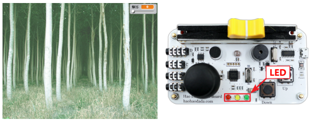
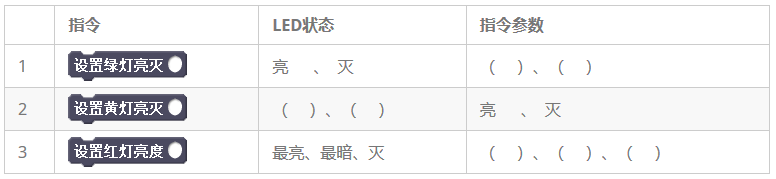
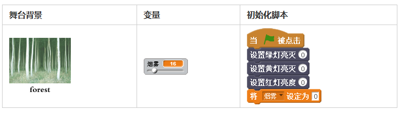
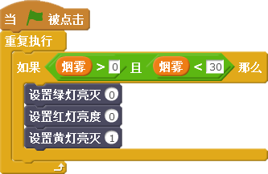
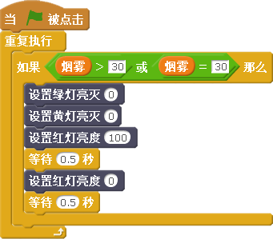
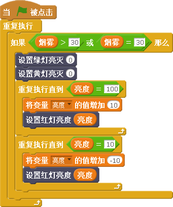

# 第三课  在Scratch中使用LED——防火小卫士 

森林之王——老虎因有事要外出，它请聪明能干的小猫暂时看守几天森林。天气渐热，正值森林火灾高发时期。为了更好地做好火灾防护工作，本课我们将通过Scratch设计一个程序，用传感器板上的LED做火灾预警，帮助小猫保卫森林。

## 模块与指令

要完成本课的创意构思，需要了解以下的新知识、使用以下的新指令：

### LED

[单击此处](http://www.haohaodada.com/video/b10301)或者扫描下方二维码可以观看相关的视频。

LED的中文名称叫做“发光二极管”。它可以把电能转化成光能，在电子电路或者仪器设备中经常作为指示灯使用，也可以用于显示文字或者数字。

在好好搭搭传感器板的正下方，有红色、黄色、绿色三颗LED，通过Scratch可以编写程序控制它们的状态。

### "设置绿灯亮灭"指令“：

设置绿色LED的亮灭，取值范围为（0，1）。当参数值为“0”时，绿色LED灭；参数值为“1”时，绿色LED亮。

### "设置黄灯亮灭"指令“：

设置黄色LED的亮灭，取值范围为（0，1）。当参数值为“0”时，黄色LED灭；参数值为“1”时，黄色LED亮。

### "设置红灯亮灭"指令“：

设置红色LED的亮度，取值范围为（0-100）。与绿色、黄色LED不同，红色LED除了参数值为“0”时不亮以外，还可以设置亮度；参数值越大，亮度越高，参数值为“100”时，LED最亮。

#### 试一试

[单击此处](http://www.haohaodada.com/video/b10302)或者扫描下方二维码可以观看相关的视频。

## 作品制作

在本课的范例作品中，可以通过拖动“烟雾”变量滑杆，模拟森林里的烟雾浓度，作为火灾预警的依据。如果没有烟雾，绿色LED亮，表示森林安全；如果有烟雾但还在安全范围内，黄色LED亮，提示森林存在安全隐患；如果烟雾超过一定范围，即将引发火灾，红色LED亮，提示森林存在危险。

### 第一步：设置舞台背景与初始化

[单击此处](http://www.haohaodada.com/video/b10303)或者扫描下方二维码可以观看相关的视频。

1.打开网络浏览器，登录“好好搭搭”网站，进入“传感器板编程设计页”，将传感器板和计算机连接起来。

2.单击“舞台列表区”中的

按钮，在打开的“背景库”对话框中，将森林缩略图（forest）作为背景图片添加到舞台上。

3.由于本课的范例作品只使用了传感器板上的LED，它在舞台上没有传感器数值显示。为了作品的美观，可以将默认显示的传感器数值都隐藏起来；同时删除默认显示的传感器板角色。

4.由于LED的状态是根据森林里的烟雾大小来确定的，因此需要新建一个变量“烟雾”，用于表示森林里的烟雾大小；同时右键单击舞台上的这个变量，在打开的菜单中选择“滑杆”选项，这样可以通过滑杆随时调整变量的值，模拟森林中烟雾的大小。

5.单击舞台背景缩略图，在“脚本区”添加如下右图所示的初始化脚本代码：

### 第二步：用绿色LED灯表示没有烟雾

[单击此处](http://www.haohaodada.com/video/b10304)或者扫描下方二维码可以观看相关的视频。

在本课的范例程序中，当“烟雾”变量值=“0”时，绿色LED亮，表示森林安全。要实现这个功能，可以单击舞台背景缩略图，在“脚本区”编写控制绿色LED的代码。

首先将“当绿旗被点击”和“重复执行”指令组合在一起，然后使用“判断”指令进行判断：如果“烟雾”=“0”时，那么绿色LED“亮”，其他LED“灭”。

### 第三步：用黄色LED灯表示有烟雾但在安全范围内

[单击此处](http://www.haohaodada.com/video/b10305)或者扫描下方二维码可以观看相关的视频。

黄色LED与绿色LED的脚本代码基本相同，都是通过设置“亮”、“灭”来表示当前森林的状态。

所不同的是“判断”指令的条件。黄色LED亮的条件应该是“烟雾变量数值”>“0”并且“烟雾变量数值”<“30”这两个条件同时满足。因此要用到“数字和逻辑运算”类别中的

指令将这两个条件组合在一起。具体的脚本代码如下图所示：

#### 试一试

黄色LED除了“亮”、“灭”这两种状态，还可以让它“闪烁”吗？

[单击此处](http://www.haohaodada.com/video/b10306)或者扫描下方二维码可以观看相关的视频。

### 第四步：用红色LED表示烟雾超出安全范围

[单击此处](http://www.haohaodada.com/video/b10307)或者扫描下方二维码可以观看相关的视频。

当“烟雾”=“30”或者“烟雾”>“30”时，红色LED亮起，表示森林存在危险。由于这两个条件只要满足其中一个就应该让红色LED亮，因此可以使用“数字和逻辑运算”类别中的

指令将这两个条件组合在一起。

好好搭搭传感器板上的红色LED与其它LED不一样，它可以设置亮度范围。因此可以有3种点亮的效果：常亮、闪烁和呼吸灯。

其中常亮和闪烁效果的脚本代码与绿色LED、黄色LED类似，如下图所示的就是满足条件后红色LED闪烁的效果：

### 第五步：让红色LED会“呼吸”

[单击此处](http://www.haohaodada.com/video/b10308)或者扫描下方二维码可以观看相关的视频。

除了让红色LED常亮和闪烁，还可以让它的亮度在最亮与最暗之间逐渐变化，就像它会“呼吸”一样。

要达到这样的效果，应该先新建“亮度”变量用于存贮红色LED的亮度值，同时设置这个变量的初始值为“0”；然后使用“重复执行”指令，让变量从“0”开始依次增加，直到最大值“100”，由于“设置红灯亮度”指令的参数值就是“亮度”变量的值，所以红色LED会逐渐亮起；再使用第二个“重复执行”指令，让变量从“100”开始依次减少，直到最小值“10”，这时红色LED会逐渐熄灭，从而实现“呼吸灯”的效果。具体脚本如下图所示：

#### 练一练

进一步完善作品，为作品添加声音效果、图片特效。比如可以根据不同的“烟雾”浓度发出不同的声音、显示不同的舞台背景图片特效。

#### 拓展思考

请结合上节课学习的内容，使用传感器板上的按键控制LED。