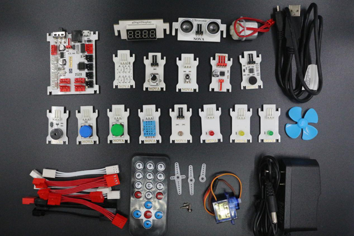
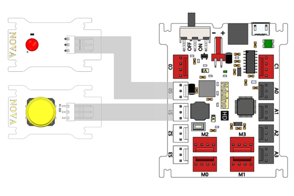
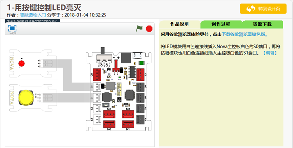
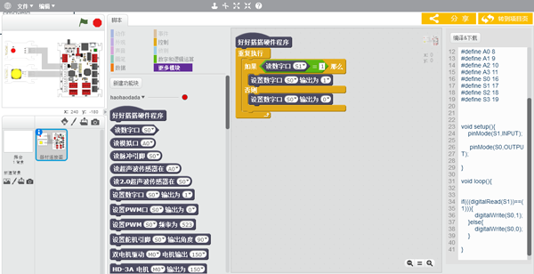
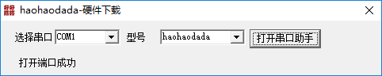

# 第1课  初识智能造物神器——Nova

“创客”，就是努力将自己的创意变成现实的人。可以说，“造物”就是创客最重要的特征之一。相对于中小学生来说，年龄较小、专业知识也比较缺乏，因此如果使用过于复杂的硬件和软件会大大增加造物的难度。 Nova是一款专门为少年儿童创客设计、开发的开源硬件，使用它可以非常方便、快速的造物，制作各种智能装置。 Nova套件主要包括主控板、各种功能模块和连接线（如下图所示）。主控板可以存储、运行程序，采集、处理和发送数据；功能模块包含各种常用的传感器模块、输出设备模块、电机驱动模块和通讯模块；使用连接线将主控板和不同的功能模块连接起来，可以创造出各种各样富有创意的智能装置。

#### 试一试：

在Nova套件中，找到主控板以及按键、亮度、声音、超声波等传感器模块，LED、蜂鸣器等输出设备模块，电机、舵机等电机驱动模块，红外遥控器等通讯模块。

## 作品制作

使用Nova造物非常方便。下面就以制作一个用按键控制LED亮灭的作品为例，介绍造物的一般过程：

### 第一步：找到造物所需器材并连接起来

要制作一个按键控制LED亮灭的Nova智能装置，需要使用Nova主控板、按键模块、红色LED模块、电源适配器以及两根白色连接线。

先找到以上这些造物所需的器材，然后按以下步骤操作，将这些器材连接起来：

1. 将1根白色连接线插入LED模块接口中、另一根白色连接线插入按键模块接口中。Nova的插口采用了防呆设计，如果插不进去就说明插反了，调换方向就可以顺利插入。
2. 找到主控板上白色的“S0”和“S1”这两个端口，将连接LED模块的连接线另一头插入“S0”端口、连接按键模块的连接线另一头插入“S1”端口。
3. 找到主控板上的电源开关，确认开关处于“OFF”关闭状态。
4. 将电源适配器一头插入220V电源插座上，另一头插入主控板的电源插口（如果不方便使用220V电源，也可以使用配套的USB线，直接连接计算机或者充电宝，由计算机或者充电宝提供电源）。所有器材连接完成后，如下图所示：

### 第二步：打开电源、运行程序

“按键控制LED亮灭”的程序在Nova套件产品出厂的时候都已经内置了，可以直接使用，不需要再编写、下载程序（如果Nova已经使用过、没有内置程序，可以直接阅读后面的内容，自己到网站上下载）。

将主控板的电源开关拨到“ON”位置、接通电源（如果使用USB线连接电源，不需要打开开关，自动接通电源）。这时主控板的绿色电源指示灯就会点亮。

如果“按键控制LED亮灭”程序已经内置在主控板上，接通电源会自动运行，按下按键，红色LED就会被点亮；松开按键，红色LED熄灭。

#### 试一试:

将电源关闭，尝试将红色LED模块换成另外颜色的LED模块，再打开电源，看看能不能也用按键将它们点亮？

### 第三步：在线修改Nova智能硬件作品程序

“好好搭搭”网站上有很多使用Nova套件制作的智能装置作品程序，要想查看、使用这些作品程序，可以按以下步骤操作：

1. 打开浏览器，进入“好好搭搭”网站（[haohaodada.com](http://haohaodada.com)），然后单击网站右上角的“登录”按钮登录网站（如果没有账号，可以先单击“加入”按钮免费注册）。
2. 登录完成后，单击网站浏览器地址栏，在地址栏中输入“[haohaodada.com/c1](http://haohaodada.com/c1)”，进入本书的范例程序网页。在该网页中找到名为“1-用按键控制LED亮灭”的作品缩略图，单击缩略图就会打开作品的程序项目页（如下图所示）。

与普通Scratch程序作品一样，Nova智能装置作品的程序项目页也是由作品名称、作者信息、作品预览以及作品说明等内容组成。一般特别需要关注“作品说明”部分，了解这个作品所能实现的功能、需要的器材以及它们的连接方法。 单击程序项目页右上角的“转到设计页”按钮，会进入这个作品的“设计页”（如下图1-4所示）。

与普通Scratch的程序设计页比较，Nova的程序设计页有以下几点不同：

1. 整个程序设计页由三个区域组成，最右边增加了“代码”区域，可以查看这个程序的C语言代码。
2. 最左边舞台区缩小；中间只有一个“脚本”选项卡，可用的只有“数据”、“控制”、“数字和逻辑运算”以及“更多模块”这四种类别的指令；
3. 在“更多模块”指令类别中，添加了许多控制Nova各种功能模块的指令。

与普通Scratch程序脚本比较，Nova程序脚本有以下几点不同：

1. 脚本的第一个指令必须是“好好搭搭硬件程序”，其它指令都应该搭建在这个指令下方。
2. 每个Nova程序只能有一个主程序。
3. Nova程序不能通过单击“绿旗” 运行，必须先单击窗口右上角的“编译&下载”按钮，在线编译后下载到主控板上才能运行。

### 试一试:

范例作品中，“S0”端口连接的是红色LED模块、“S1”端口连接的是按键模块。如果将这两个模块所连接的端口调换一下：也就是红色LED模块连接到“S1”端口、按键模块连接到“S0”端口，程序应该如何修改？

### 第四步：连接主控板、运行插件程序

与Scratch传感器板一样，Nova程序编写完成后，必须把主控板和计算机连接起来，再运行一个插件程序，才能把程序代码下载到主控板上。具体可以按以下步骤操作：

1. 用USB线把主控板和计算机连接起来。将USB小口端的插头插入主控板的接口，大口端的插头插入计算机的USB接口。
2. 确认已经在计算机上安装了“好好搭搭插件”程序。如果没有安装，可以按照“阅读材料一”介绍的步骤安装。
3. 找到并且双击运行计算机桌面上的“硬件下载插件”程序图标，运行“好好搭搭硬件下载插件”程序。如果在计算机桌面上找不到这个图标，可以单击桌面左下角的“开始”按钮，在打开的“程序”中找到名为“haohaodada”的程序组，该程序组中就包含有“硬件下载插件”图标。
4. “好好搭搭硬件下载”插件程序运行以后，会显示如下图所示的对话框。如果对话框左下角显示“打开端口成功”，说明主控板与Scratch连接正常。

   

### 第五步：在线编译、下载程序到主控板

与Scratch传感器板不同的是，用Scratch编写的Nova程序，是不能在线运行的。必须先编译成主控板能够识别的机器码，然后下载到主控板上才能运行。可以按以下步骤操作：

1. 单击窗口最右边“代码”区域中的“编译&下载”按钮，浏览器将编写完成的程序代码上传到服务器进行编译，编译成Nova能够运行的机器码。
2. 服务器编译一般需要3-5秒，编译完成后会弹出一个名为“提示”的对话框（如下图所示）。单击对话框中的“下载”按钮，可以将程序下载到Nova主控板上。
3. 下载的程序存贮在主控板的存贮器上，关闭电源也不会丢失，除非被新下载的程序替代。下载一旦完成，主控板马上会自动运行这个程序。

   

当主控板与计算机处于USB连接状态时，不需要外接电源，直接通过USB线使用计算机主板供电；当主控板脱离计算机单独运行时才需要外接电源。使用外接电源时，电源开关可以控制电源的通断；电源接通，主控板存贮的程序会自动运行。

## 拓展与思考

试着将LED插到其它的端口，然后修改程序代码，看看能不能通过按键将它点亮。

