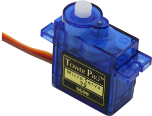
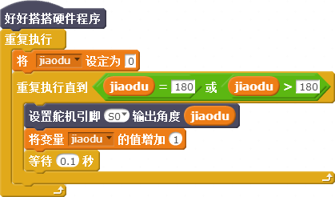

# 第10课 在Nova中使用舵机——会摇头的电风扇

很多电风扇、特别是台式电风扇的风扇叶都会左右摆动，俗称“摇头电风扇”。这种结构的电风扇吹出的风更自然、使人感觉更舒适。本课我们将在上一课所制作的“智能小风扇”作品基础上，为电风扇增加风扇叶左右摆动功能。

## 模块与指令

**要制作本课的范例作品，需要认识以下这些新的硬件：**

### 舵机模块

舵机，也叫做伺服电机，是一种可以把接收到的电信号转换成精确旋转角度的电机。海模爱好者经常用这种电机来控制模型船的方向舵，所以约定俗成地都叫它“舵机”（如下图10-1所示）。

标准的舵机有3条控制线，分别是棕色的接地线（简称GND）、红色的电源线、橙色的信号线。

Nova套件中的舵机附送了“十字形”、“一字形”、“半一字形”这三种不同形状的摆臂，还有将摆臂固定到舵机上的一颗小螺丝、将舵机固定到结构件上的两颗大螺丝。

**要制作本课的范例作品，还需要使用以下新的指令：**

### “设置舵机输出角度”指令：

使用这个指令可以设置指定端口舵机的输出角度。指令默认端口是“S0”、输出角度是90度；通过单击第一个参数的下拉列表，可以选择S0—S3这4个数字端口以及A0—A3这4个模拟端口；通过单击第二个参数下拉列表或者直接输入，可以设置舵机的输出角度，它的取值范围是（0，180）。

## 作品制作

要制作本课的范例作品，可以按以下步骤先连接硬件、运行插件程序，然后进入“好好搭搭”网站编写、调试、编译、下载程序。

### 第一步：搭建硬件、运行插件

首先将模块与主控板连接起来：单路电机驱动模块连接“M0”端口，将风扇叶安装到130电机的转头上、电机的连线插入单路电机驱动模块；将十字型的摆臂用螺丝固定到舵机上，舵机连接线的另一头插入“S0”端口，由于舵机没有使用Nova防反插连接线，因此插的时候可以查看主控板“S0”端口的反面，确保棕色连接线对准“G”、红色连接线对准“V”、橙色连接线对准“P20”（如下图所示）；接着把主控板和计算机连接起来，最后打开“好好搭搭硬件下载”插件，确认插件程序显示“打开端口成功”。

### 第二步：校正舵机的旋转角度

登录“好好搭搭”网站，选择“创作”栏目中的“haohaodada\_NOVA模版”，进入“NOVA编程设计页”进行编程。

舵机装上摆臂、第一次使用之前，最好先校正一下它的角度。可以使用“重复执行”指令，重复执行“设置舵机输出角度”指令，设置这个指令的参数为“0”。由于舵机连接的是“S0”端口，因此这时舵机的方向应该是“0°”（具体程序代码如下图所示）。

由于本课范例作品使用的是“一字型”摆臂，0°状态正好和舵机垂直（如下图所示），如果安装的时候角度不正确，可以旋松固定摆臂的螺丝，重新安装。

#### 试一试：

上图所示代码中，请你再设置其它的舵机输出角度值，然后编译、下载到主控板上执行程序，观察舵机实际指向的角度，你发现了什么？

### 第三步：控制舵机顺时针旋转

要控制舵机顺时针旋转，也就是角度值从0°依次递增到180°，可以按以下步骤操作：

1. 单击“数据”类别中的“新建变量”按钮，在打开的“新建变量”对话框中输入新变量的名称“jiaodu”，单击“确定”按钮完成新建变量。
2. 添加“重复执行”指令，重复执行“将变量设定为”和“重复执行直到条件成立”指令；确认“将变量设定为”指令第一个参数是“jiaodu”、第二个参数是“0”。
3. 设置“重复执行直到条件成立”指令的条件为“jiaodu”变量“等于”“180”或者“jiaodu”变量“大于”“180”。设置“重复执行直到条件成立”指令条件成立时执行“设置舵机输出角度”、“将变量值增加”和“等待”指令；设置舵机输出角度值为“jiaodu”变量，确认“将变量值增加”指令第一个参数是“jiaodu”、第二个参数是“1”，设置“等待”指令参数为“0.1”秒。

具体程序代码如下图所示：

#### 想一想：

上图所示程序中，重复执行的这段脚本叫做“当”循环。它可以一边重复执行、一边进行判断，一直到“jiaoda”变量值大于、等于180这个条件成立，才停止重复执行；反之也就是说，“jiaoda”变量值小于180时，舵机会一直顺时针旋转、累加角度值。

而下图所示的程序也可以控制舵机顺时针旋转，但它使用的是“重复执行指定次数”指令。

想一想，这两段程序脚本有什么不同？你喜欢哪一段脚本？为什么？

### 第四步：控制舵机180°来回旋转

要让舵机180°来回旋转，也就是角度值从0°依次递增到180°，再从180°依次递减到0°，可以使用两次“重复执行直到条件成立”指令。第一次是旋转、累加角度值；第二次是旋转、累减角度值。具体的程序代码如下图所示：

#### 试一试：

上图所示程序代码中，每个“重复执行直到条件成立”指令里面都有一个“等待”指令。试一试删除这个指令，舵机还能够正常来回旋转吗？为什么？

### 第五步： 会摇头的电风扇

要让风扇一边摇头、一边扇，应该先把装有风扇叶的电机固定到舵机的一字形摆臂上（建议用胶枪固定），然后修改上图所示的程序，在顺时针和逆时针旋转的重复执行代码中，分别添加两个“设置电机输出”指令。具体程序代码如下图所示：

#### 练一练：

上图所示的程序，编译、下载到主控板上会马上运行。能不能再添加红外遥控的代码，只有按遥控器上的“OK”按键，风扇才会运行。

## 拓展与思考

请进一步完善程序，让红外遥控器不仅能够控制风扇开、关，还能够控制风扇的转速。

