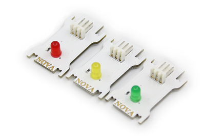
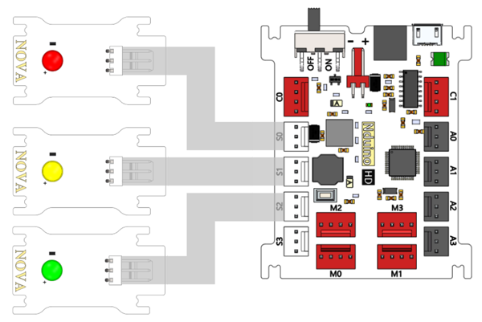
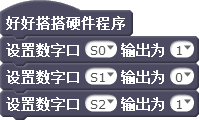
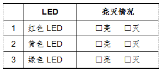
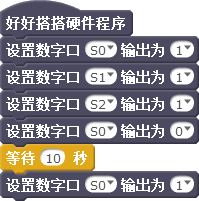
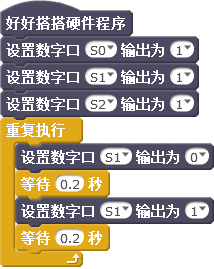

# 第2课  在Nova中使用单色LED——模拟红绿灯

自从20世纪60年代研制出能够发出红色光的LED以来，经过几十年的发展，目前的LED已能发出红、橙、黄、绿、蓝等多种有色光。本课我们将使用3个单色LED模块，制作一个模拟交通红绿灯的创客作品。

## 模块与指令

**要制作本课的范例作品，需要认识以下这些新的硬件：**

### 单色LED模块

Nova套件中包含3个单色LED模块，可以分别发出红、黄、绿三种颜色的光线（如下图所示）

LED的中文名称叫做“发光二极管”，它是一种可以把电能转化成光能的电子元件。经常在电路以及仪器中作为指示灯使用，也可以用于显示文字或者数字，随着技术的发展，目前也广泛用于日常生活照明。

**要制作本课的范例作品，还需要使用以下新的指令：**

### “设置数字口”指令：

使用这个指令可以设置指定数字口的输出值。指令默认端口是数字口“S0”、输出值为“1”。通过单击下拉列表，可以选择S0-S3这4个数字端口、A0-A3这4个模拟端口；输出值可以设置为“1”或者“0”，也就是高电平或者低电平。

## 作品制作

要制作本课的范例作品，可以按以下步骤先连接硬件、运行插件程序，然后进入“好好搭搭”网站编写、调试、编译、下载程序。

### 第一步：搭建硬件、运行插件

首先将3根白色连接线分别插入3个LED模块的接口中；然后将红色LED模块插入S0端口、黄色LED模块插入S1端口、绿色LED模块插入S2端口（如下图所示）；接着用USB线把主控板和计算机连接起来，打开“好好搭搭硬件下载”插件，确认插件程序显示“打开端口成功”。

### 第二步：进入网站、了解指令

打开浏览器，登录“好好搭搭”网站；单击网站上方的“创作”按钮，在“创作模版”网页中选择“haohaodada\_NOVA”模版，进入“模版项目页”；在“模版项目页”中单击网页右上角的“转到设计页”按钮，进入“NOVA编程设计页”。

单击“脚本”选项卡的“更多模块”类别，找到“设置数字口输出”指令，将这个指令拖动三个到脚本区，设置端口分别为“S0”、“S1”、“S2”，输出值分别为“1”、“0”、“1”。具体程序代码如下图所示：

#### 试一试：

将上图2-3所示程序编译后下载到主控板，运行后观察3个LED亮灭的情况，将结果记录在下面的表格上。

### 第三步：控制红色LED亮灭

在本课的范例作品程序中，需要先对3个LED模块的状态初始化，设置相应端口输出值为“1”，让LED处于“高电平”，也就是“灭”的状态。 然后设置红色LED模块所在的端口“S0”的输出值为“0”，再设置等待时间为“10”秒，也就是红色LED亮10秒。最后再设置“S0”这个端口的输出值为“1”，让它处于“灭”的状态。具体程序代码如下图所示：

#### 试一试：

红色LED熄灭以后，你还能再继续编写代码，让绿色LED也亮10秒以后熄灭吗？

### 第四步：控制黄色LED闪烁

所谓的“闪烁”，其实就是设置LED快速的亮灭。

要让黄色LED闪烁（比如以0.2秒为间隔闪烁），同样先初始化3个LED模块状态；然后使用“控制”类别中的“重复执行”指令；每次重复都是先设置黄色LED输出值为“0”、等待时间为“0.2”秒，再设置黄色LED输出值为“1”、等待时间也是“0.2”秒，这样黄色LED就会以0.2秒为间隔一直闪烁。具体程序代码如下图所示：

#### 试一试：

编写一个让2个LED交替闪烁的程序（比如红灯亮的时候黄灯灭、红灯灭的时候黄灯亮）。

## 拓展与思考

请你观察学校或者家附近十字路口红绿灯的变换情况，然后编写一个程序完整的模拟这个路口红绿灯的亮灭。

fs

